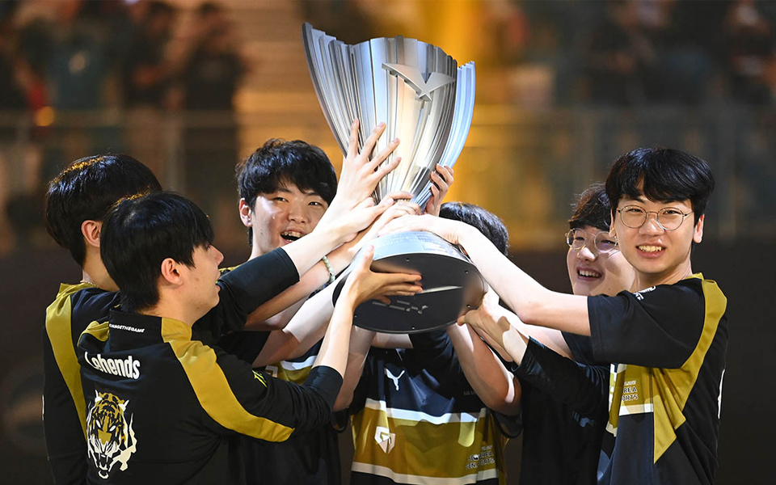

## 4강에서 멈춘 롤드컵

롤드컵이 끝났다.

8강부터 불안불안하던 젠지의 경기력, 또 기세를 탄 DRX

그 만남에서 도란 피넛의 최저점, 쵸비의 평균점이 떠버려 시즌 중에 한번도 패배하지 않았던 DRX에게 3:1 패배를 당하게 됐다.

아… 너무 아쉽다.

또 조금 아쉬운 것은 커뮤니티 분위기가 DRX의 기적을 지지했고, 젠지가 그 희생양이 되어야 할 것 같은 분위기고 그렇게 됐다는 점이다.

하지만 이번 시즌 한 해 스프링부터 서머 시즌 체급의 젠지 역시 기대 이상의 성과도 냈고, LCK에서지만 무관을 끊어낸 4명의 멤버들에게도 의미가 큰 한 해일 것이다.

## 2022 LCK 섬머 우승의 기억



이 땐 정말 롤드컵도 씹어먹어 줄 거라 생각 했는데...

올 한해 고생했고, 내년 시즌 같은 멤버로 다시 롤드컵 들 수 있으면 좋겠다.

고생했다