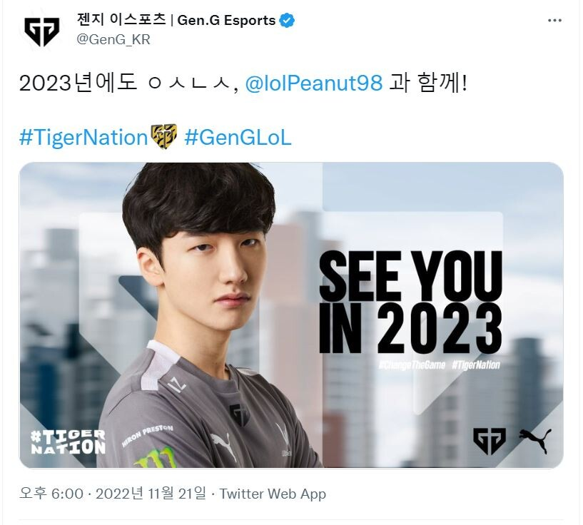

## ㅇㅅㄴㅅ

스토브 리그가 시작되고, 첫 젠지 발표는 피넛 재계약이다.

물론 스토브 리그 이전에 룰러 FA 발표가 있었지만, 스토브 리그 전 소식이기도하고, 아직 일말의 희망이 남아있는 만큼 공식 발표는 피넛이 처음이라고 볼 수 있다.

쵸비는 시즌 중에 재 계약 한 만큼, 피넛, 도란, 리헨즈의 재계약 여부가 중요했는데 이 중 피넛은 우선 성공했으니 다음 시즌도 상위권으로 갈 수 있는 발판은 서지 않았을까 싶다.

개인적으로 도란까지만 잡는다면 다음 시즌을 기대해봐도 된다고 기대해보고 싶다.

물론, 바텀 라인이 워낙 중요하고 상향 평준화 되어있어서 콜업으로 대처하려 한다면 걱정이 안되는건 아니지만 말이다.

롤은 미드, 정글 중심의 게임이니 만큼 우선 중심축 재계약만 봐도 그래도 조금은 마음이 놓인다.

다른 선수들 재계약도 힘내보자 젠지! 아자~