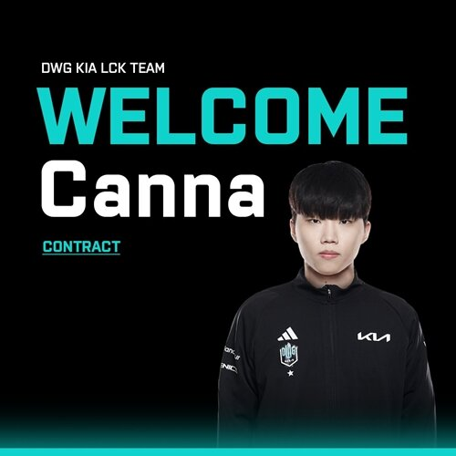
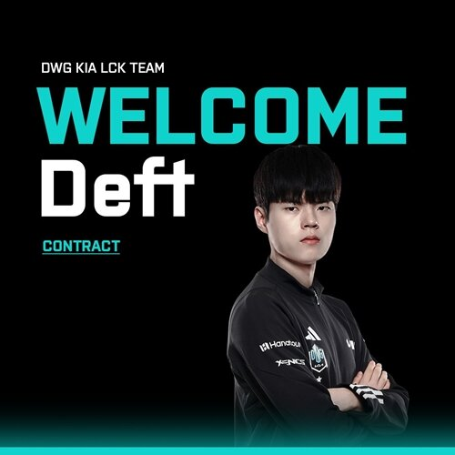

## 이번 시즌 이야기

개인적으로 덕담의 캐리력이 중요한 순간 못나왔다고 생각이 들었던 한해다.

분명 룰러, 구마유시보다 밀렸던 원딜인건 맞으니 말이다.

너구리도 반시즌 뛰다보니 과거의 포스가 나오지 못했고, 버돌은...뭐 아시는 대로...

## 그래서 누가 온다고?

그렇다보니 탑과 원딜을 교체하고자 했는데, 탑은 작년에 데려오려 했던 칸나, 원딜은 덕담과 계약을 해지하고 데프트를 영입하는 데에 성공했다.

바이퍼 영입 시도를 했으나 자금 문제로 실패한 걸로 알려져있는데, 데프트 영입이면 남은 영입 대상 중 가장 훌륭한 영입이라고 생각된다.

칸나 역시 리그 상위권 탑솔러였고, 데프트야 말할 거 없는 레전드다.

현재의 스토브 리그에서 훌륭한 마침표가 아닌가 싶은 생각이 드는 영입이라고 볼 수 있따.

### 다음 시즌은?

캐쇼가 든든하게 버텨주는 만큼, 다음 시즌도 상위권 경쟁에 롤드컵 진출은 성공하지 않을까 싶다.

물론 여전히 게임 리딩 역량이 아직 아쉬움이 있다는 의견도 있지만, 쇼메이커가 이 부분의 역량이 늘고 있는 것이 많이 보인 만큼 기대할 만한 시즌이 되지 않았나 싶다.