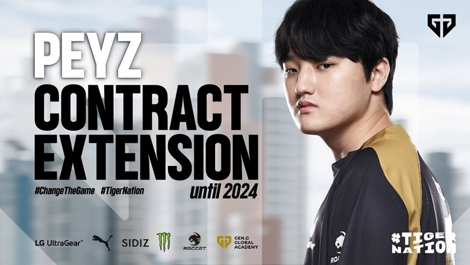

## 젠지로스터 이틀만에 완성

예상대로 딜라이트를 여입했고, Peyz의 콜업이 확정인 걸로 보인다.
이로써 룰러는 징동 합류가 99% 가까워 진 듯 하다.

상체 조합이 워낙에 강한 만큼, 바텀에서 경험치를 많이 먹을 수 있는 기회가 될 수 있기 때문에 한화라는 슈퍼팀, 다수의 멤버가 3년 이상 조합을 맞춘 T1, 캐쇼 조합이 든든한 (바텀, 탑이 물음표지만) 담원 등과 비교해도 충분히 경쟁 가능한 라인업이라고 믿을 수 있을 것 같다.

젠지훈 피셜로는 아마 젠지의 자금 사정이 악화되서 리헨즈를 풀어준 것 같은데, 리헨즈도 KT 이적설이 있는 만큼 KT도 좋은 멤버를 구성해서 LCK 자체를 보는 재미가 있으면 좋을 것 같다.