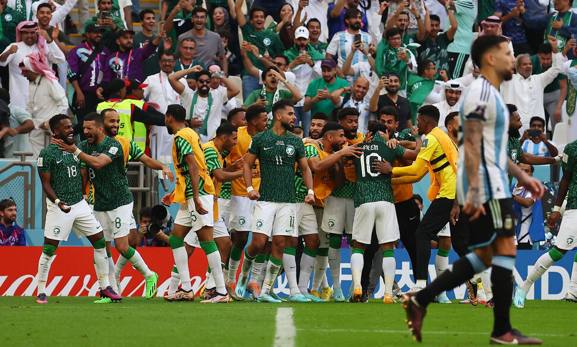
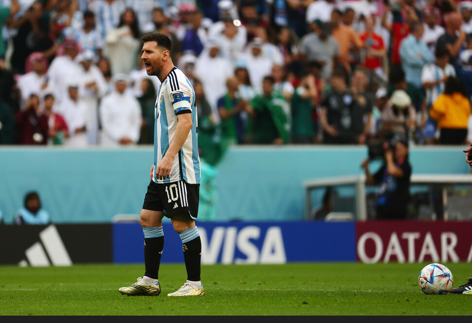

# 대 이변

메시가 이끄는 아르헨티나가 결국 사우디의 수비벽을 뚫지 못하고 2-1로 패배했다.

2002월드컵 8대0 치욕적 대패의 역사를 가진 팀으로써, 기대 이상의 결과다

사우디는 16강 진출의 희망을 갖게됐는데, 같은 조의 멕시코와 폴란드가 비겼기 때문에 아주 유리해진 입장이라고 할 수 있다.



---

# 다른 아시아 국가는?

이란 2 : 6 잉글랜드



프랑스 4 : 1 호주



카타르 0 : 2 에콰도르



일본 ? : ? 독일

독일의 우세가 점쳐지는 상황에서, 사우디의 승리는 아시아의 빛이 될 가능성이 높아보인다.

---

# 우리는?

우루과이와 11월 24일 오후 10시(한국 시간 기준)에 경기를 치른다.

우루과이와 우세했지만 아쉬운 패배를 했던 2010년도 있고, 친선전에서는 승리를 거둔 경험도 있다.





물론 월드컵 무대는 중압감이 다르고, 우리는 베스트 멤버도 아니다. (황희찬 이탈, 손흥민 안면 부상 후 마스크 착용)

[[월드컵] 황희찬 이탈, 벤투가 꺼낼 플랜B는…나상호·獨 정우영 카드도 만지작](https://n.news.naver.com/sports/qatar2022/article/421/0006475203)

플랜 A를 선호하는 벤투 입장에서 주전 선수 한명은 많이 큰 편이다.

그럼에도 항상 도깨비 팀의 면모를 보여온 한국 대표팀의 저력을 믿고 싶고, 리스크를 감수하고라도 경기를 뛰겠다는 손흥민 선수의 의지도 빛을 발했으면 좋겠다.

대한민국 파이팅!!!