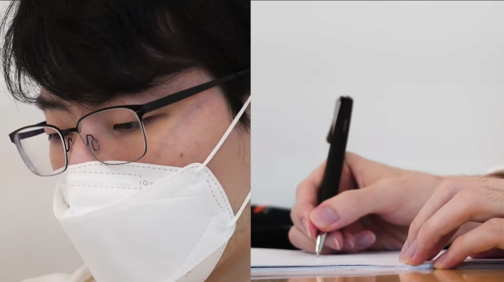
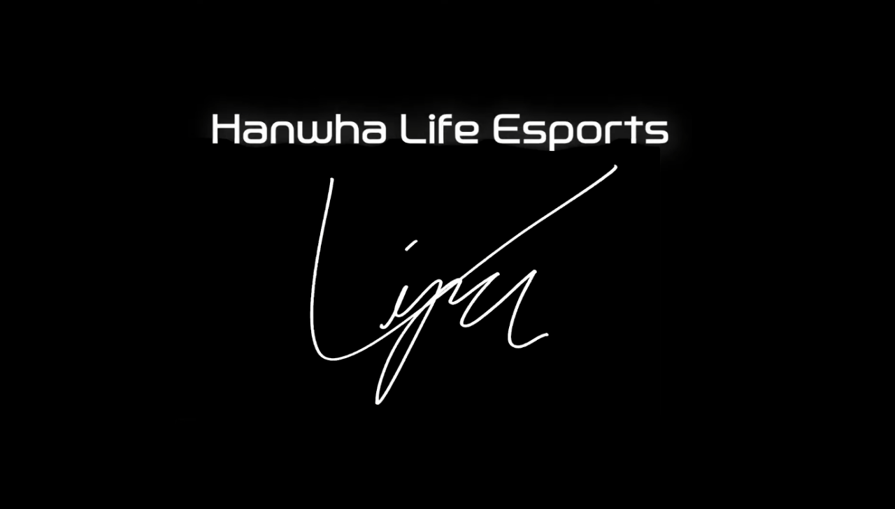

## 작년 이야기

작년 한 해 데프트, 쵸비의 차력쇼를 통한 롤드컵 8강을 거두고, 쵸비, 데프트와의 재계약에 실패하고 추가 선수 영입에 실패하며, 아쉬운 최하위권 성적을 거뒀다.

## 바이퍼 리턴, 진짜 슈퍼팀이...?

작년에 아낀 돈을 올해 쓸 수 있는 것인지 역대급 슈퍼팀이 결성 될 지 모른다는 소식이 유력했는데, 그 시작으로 바이퍼가 2년만에 복귀하게 됐다.



### 커뮤니티 추정 로스터

탑 - 너구리 or 라스칼 or 두두

정글 - 클리드

미드 - 스카웃 or 제카

원딜 - 바이퍼

서폿 - 베릴 or 메이코

라는 EDG 월즈 조합 + @로 로스터를 구성한다는 얘기가 오가고 있다.

아직은 추측이지만 바이퍼의 영입으로 현실화되어가는 단계인 듯 하다.

이정도 조합이면 분명히 상위권 성적이 나올 확률이 매우 높기에 리그를 보는 재미가 생길 것 같다.

---

## 짤막 KT 소식

아직 썰이지만 KT에 기인 선수, 비디디 선수가 합류한다는 소문도 돌고 있다.
KT도 서폿만 잘 잡으면 커즈, 에이밍이 있는 만큼 상위권 경쟁을 할 수 있는 로스터가 될 수 있다는 기대감도 생기고 있는 만큼, 생각보다 스토브 리그가 재밌게 흘러가고 있는 듯 해서 여러모로 기대가 된다.