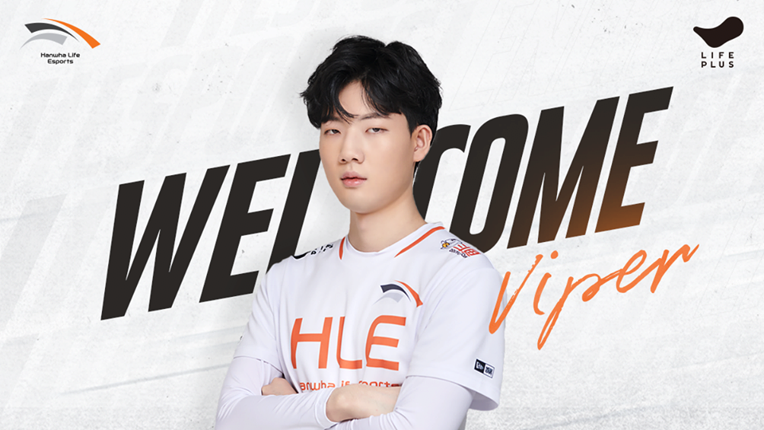

## 한화 생명 로스터 완성

유스 선수 위주로 한 시즌을 보낸 한화 생명이 로스터를 완성했다.

먼저 영입된 바이퍼와, 유스 출신 두두, 그리고 제카, 킹겐, 클리드, 라이프다.

### 슈퍼팀은 아닌거 같은데?

개인적으로 킹겐이 체급이 높거나, 평균 경기력이 좋았다고 생각하지 않는다.

대운이, 그리고 OP챔을 T1이 풀어서 롤드컵 결승 MVP가 됐던거라고 생각하는데, 그런 면에서 두두까지 있으니 탑은 선택적으로 기용이 되지 않을까 싶다.

그걸 감안해도 탑은 슈퍼팀에 많이 아쉬운 편이라 볼 수 있고, 라이프 역시 좁은 챔프폭과 경기 운영 능력의 아쉬운 선수다보니 이 마저 애매하다.

클리드 역시 피지컬과 갱킹 능력 대비 아쉬운 뇌지컬이 발목을 잡았던 지라 전체적으로 걱정이 되는 구성이 아닌가 싶다.

조금 핀트 안맞기 시작하면 시즌 전체 성적이 좋지 않을 수도 있다는 생각?

사실 페이커가 재계약 한다는 전제하에 모든 팀이 살짝씩 아쉬움이 있는 만큼 플옵은 갈거 같지만, 상위권일지는 잘 모르겠다.

물론 선수들 개개인은 (탑을 제외하면) 훌륭한 퍼포먼스를 보여줬던 만큼 LCK 전체의 선수들 평균 능력이 올라 간 것 같아서 다음 시즌이 기대 된다.