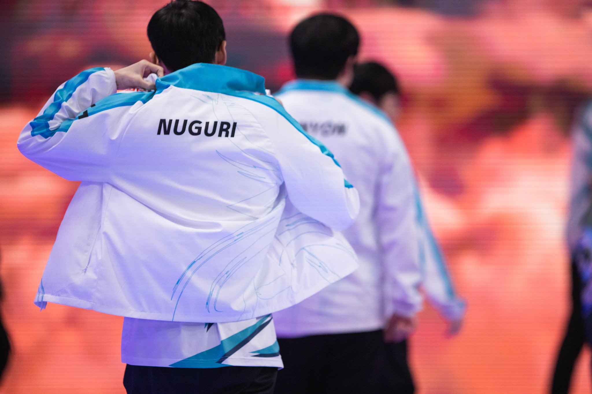

## 페이커 3년 재계약

무려 12년간 한 팀에서, 그리고 하나의 게임에서 뛰는 전설적인 선수가 되는 기록이 나올 예정이다.

피지컬이 중요하다 여겨지는 미드에서, 그것도 치열한 LCK에서 이런 선수가 나오다니 놀랍고 멋지다.

DRX의 기적과 같은 롤드컵 우승에 가려졌지만, 페이커도 5년만에 결승에서 준우승을 거두며 세계 최상위권 미드라이너이며, 최상위권 경쟁력의 팀임을 증명했다고 볼 수 있겠다.

### 너구리 은퇴

건강 이슈가 계속 발목을 잡았던 너구리가 결국 은퇴를 결정한 걸로 보인다.

어느 팀이건 한 시즌 더 뛰어줬으면 하는 바램이 있었지만, 너무 힘드니까 은퇴한 거라고 생각이 든다.

데프트, 페이커를 보면 프로게이머 연령 상한이 높아지는 기조에서 너구리 같은 탑 클래스 선수가 은퇴한 것은 너무 아쉽다.

아마도 담원은 알고 있었던 것 같고, 그래서 칸나 선수를 빠르게 영입한 걸로 예상된다.

너구리 선수 고생했고, 2020 롤드컵 LCK에 가져다 준 것 잊지 못할 것이다.

너구리 선수 수고하셨습니다.