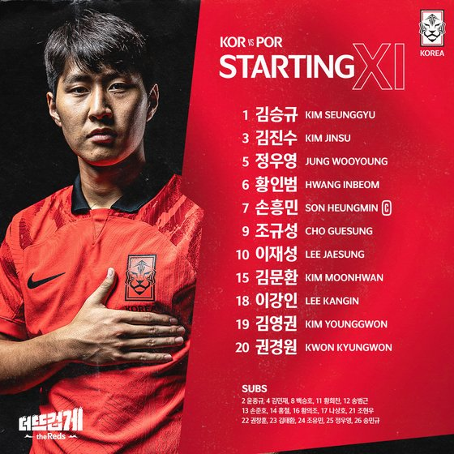

## 다른 아시아 국가는?

### 호주 16강 진출, 이란, 사우디 탈락

이미 탈락했던 카타르를 제외하고 모든 아시아팀에게 기회가 있었다.

그럼에도 이란, 사우디는 탈락했다.



이란은 비기기만 해도 됐는데, 탈락하고 말았다.



반면 호주는 덴마크를 제치고 16강에 오르는 쾌거를 이뤘다.



### 일본, 스페인 잡고 조 1위 진출

스페인 전을 잡을 줄이야... 그것도 대회 독일, 스페인전 모두 역전이다.

경기는 실리 축구에 가까웠지만, 그럼에도 일본이 조 1위로 올라간 것은 대단한 업적이며, 이 또한 기적이라고 볼 수 있겠다.



## 한국 vs 포르투갈

선발 명단이 발표되고, 김민재의 부재, 이재성 윙 기용, 이강인 선발등 기대를 품기 충분했다.

그럼에도 아쉬운 것은 황희찬이 선발이 아니었다는 점?

경기는 초반 5분만에 실점하며  암울해지는 듯 했으나, 김영권의 코너킥 상황 호날두 어시를 받아 골을 넣은 뒤, 계속 오프사이드 트랩에 걸리거나 소녀 슛, 걷어내기 등을 해준 호날두의 활약으로 기대를 품게 됐다.

역시 포르투갈은 매서웠고, 교체 멤버가 들어올 수록 부담은 더 해졌으나 한 건 해낼 거 같은 묘한 기대감이 커졌다.

특히 황희찬이 교체되고 상대 수비진을 흔들며 기회가 조금씩 더 생겼다.

마침내 후반 추가시간에 손흥민에게 역습 기회가 왔고 경기장을 끝에서 끝까지 뛰고 난 뒤, 상대 수비진에 둘러 쌓인 상태에서 수비수 가랑이 사이로 패스를 했고, 절묘하게 연결된 황희찬의 다이렉트 마무리로 기적의 역전승을 거둔다.

3경기 내내 수비수들은 손흥민의 직접 슈팅을 견제하는 모습을 보였고, 제 컨디션이 아니라해도 손흥민에겐 최소 2명의 수비수가 애워쌌다.

견제와 컨디션 저하로 아쉬운 경기력을 보였지만, 본인의 클래스를 증명했고, 결과로 보여줬다.

이 것이 손흥민을 뺴지 못하는 이유였고, 그에게 기대하는 모습을 결국 보여줬다.



이런 극적인 승리에도 불구하고, 우루과이 전 경기는 10분 가까이 남았었는데 우루과이가 2:0 상황이라 한골만 더 넣어도 우리는 탈락인 상황이었다.



우루과이는 우리 경기 결과를 알게 된 듯 했고, 추가 시간에 시간을 끌어주고 열정적인 수비를 통해 우루과이를 탈락시켜줬고, 그들도 신의손 사건에 대한 우루과이에 대한 반감이 있었고, 본인들이 못올라간다면 차선으로 우루과이의 탈락을 바랬던 것을 우리도 느낄 수 있었다.

결국 16강 진출했고, 그 낮은 확률을 뚫고 우리는 기적을 썼다.

## 16강 브라질전

사실 우리는 할만큼 했고, 잃을게 없다.

우리는 져도 비난 받지 않을 도전자의 입장이고, 우승 후보 브라질은 부담감을 가지게 된다.

5대1 친선전 패배는 말 그대로 친선전이고, 우리는 포르투갈전 승리도 해냈으며, 더 낮은 확률의 16강 진출도 해낸 입장에서 더 맘편히 경기를 즐기다보면 분명히 승리도 거둘 수 있을거라고 생각한다.

그럼에도, 만약 진다고 해도 선수들에게 비난보다는 칭찬을 해주면 좋겠다.