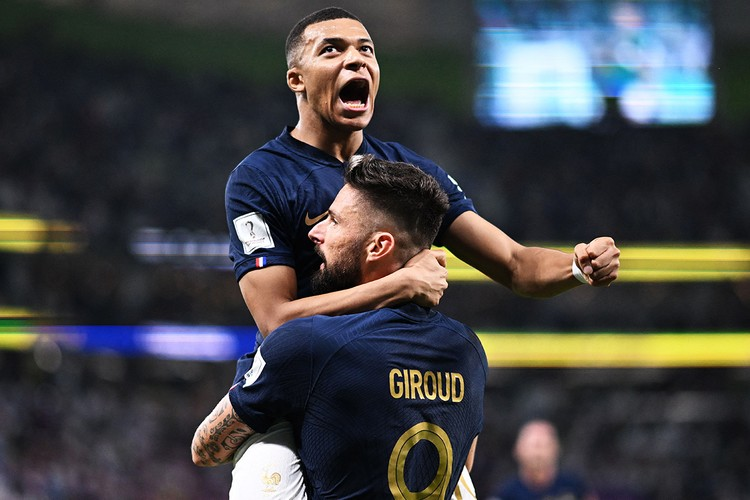
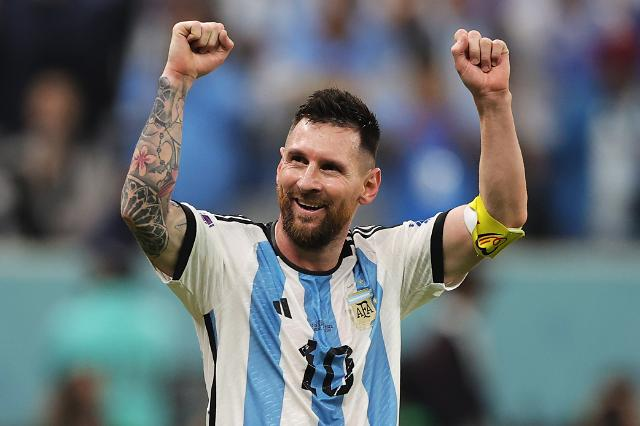

## 크로아티아 vs 모로코

모드리치와 크로아티아는 꽤 지쳐보였고, 메시는 지치지 않았으며 클래스를 보여줬다.

특히 알바레즈의 활약은 결승전을 기대 할 만 하게 해주었다.

모로코도 스코어는 2:0 이지만 경기 내용 자체는 저력을 보여주었다.

개인적으로 크로아티아의 2:1 승리를 예상해본다.

## 아르헨티나 vs 프랑스

분명히 프랑스가 조금 더 정배에 가까워 보인다.

전체적인 전력도 훌륭하며, 그리즈만의 메짤라 포지션에서의 활약은 충분히 정배를 받을만하다.

평균 전력도 더 우월한데, 체력 관리도 좀 더 잘되어있다.

그럼에도 나는 메시의 대관식을 보고 싶다.

월드컵을 들지 못해 수 많은 커리어의 방점을 못찍은 메시.

내가 바르셀로나 팬이기도 하지만, 메시의 팬이기도 하다.

호나우딩요를 보며 자란 소년은 세계적인 선수가 됐지만, 월드컵을 들지 못해 평가 절하되는 것이 아쉽다.

그 힘들었던 코파 아메리카도 작년에 드디어 들었다.

8년전 괴체의 원더풀 골 앞에 한 끝이 모자라 들지 못했던 월드컵.

이번엔 들었으면 좋겠다.

심지어 이번 대회는 준우승 골든볼을 받은 2014년보다 더 좋은 경기력과 기록을 보여주고 있다.

35살의 메시는 이번 대회가 마지막 월드컵이다.

전설의 아름다운 퇴장을 꼭 보고 싶다.