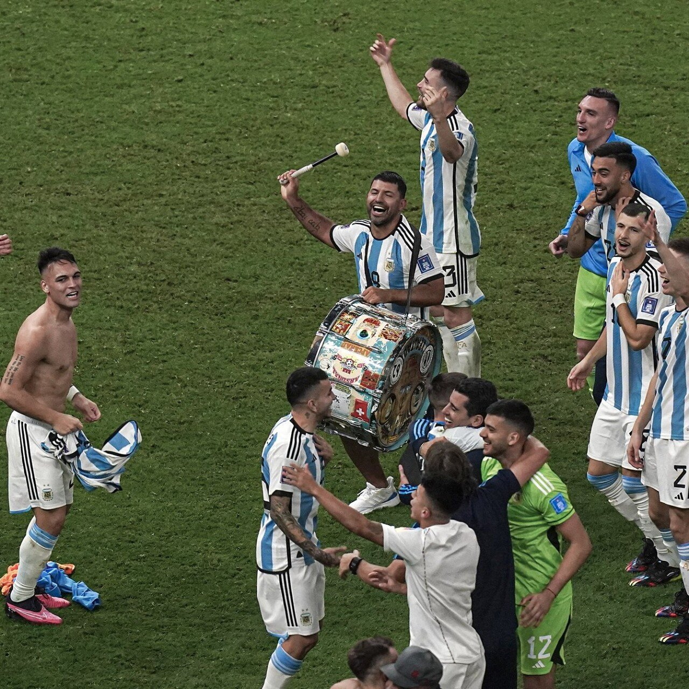
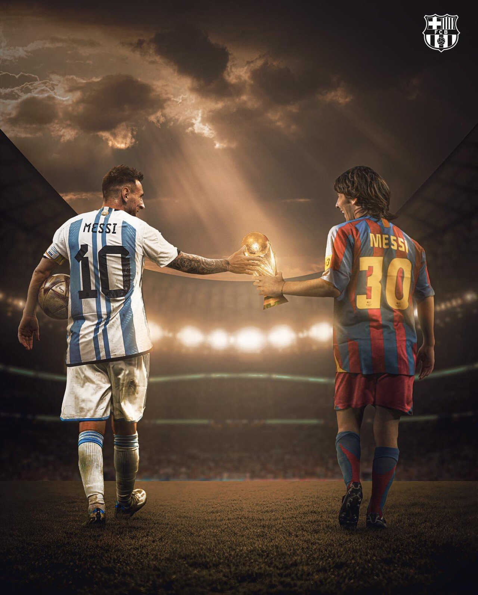
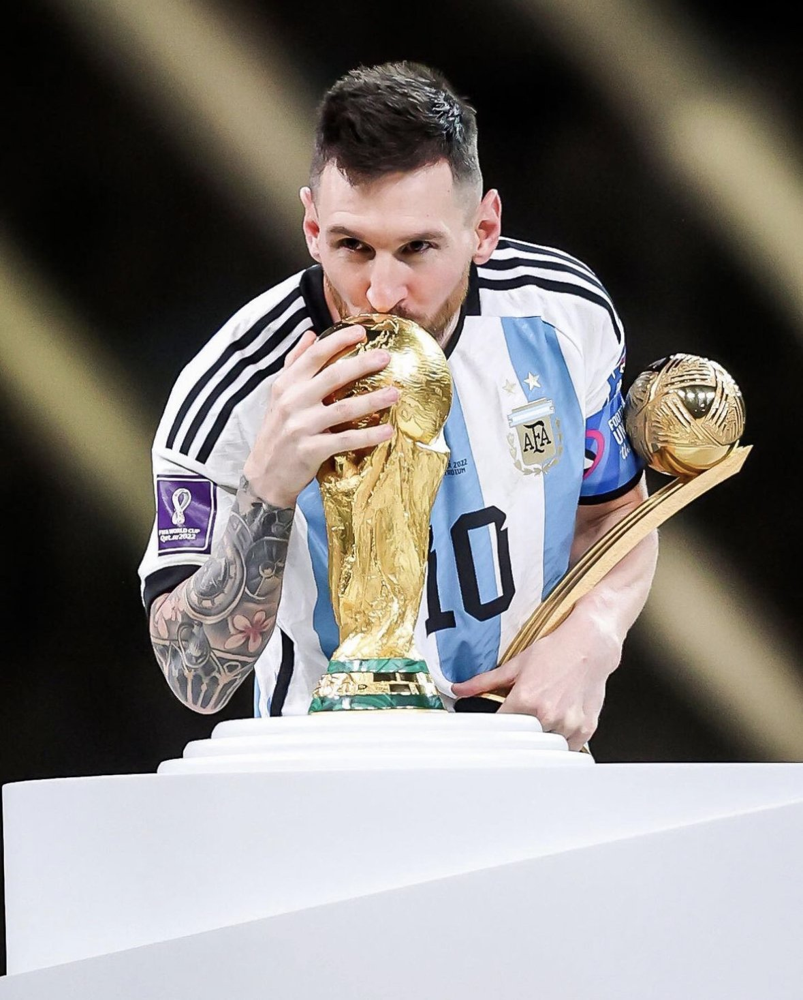
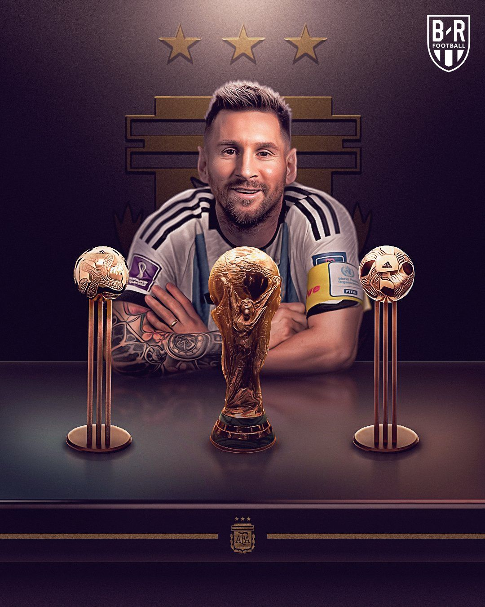
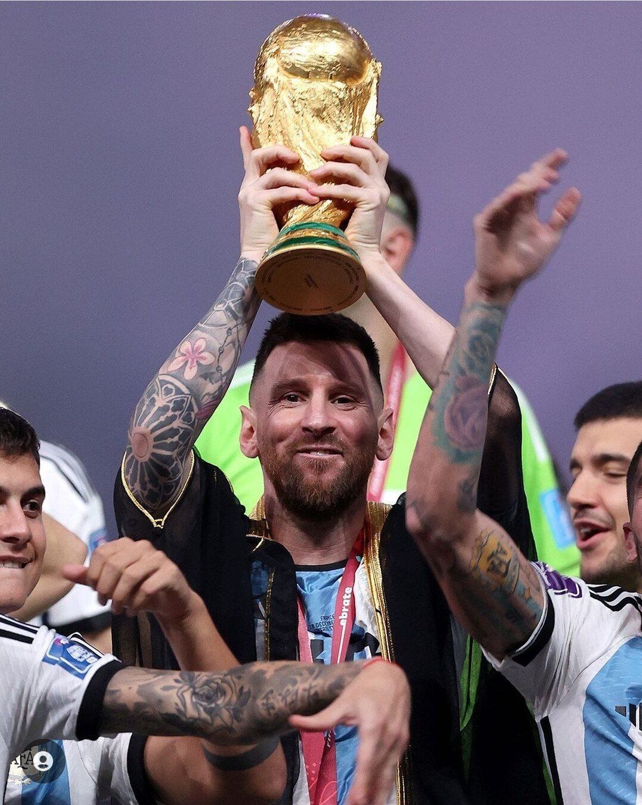
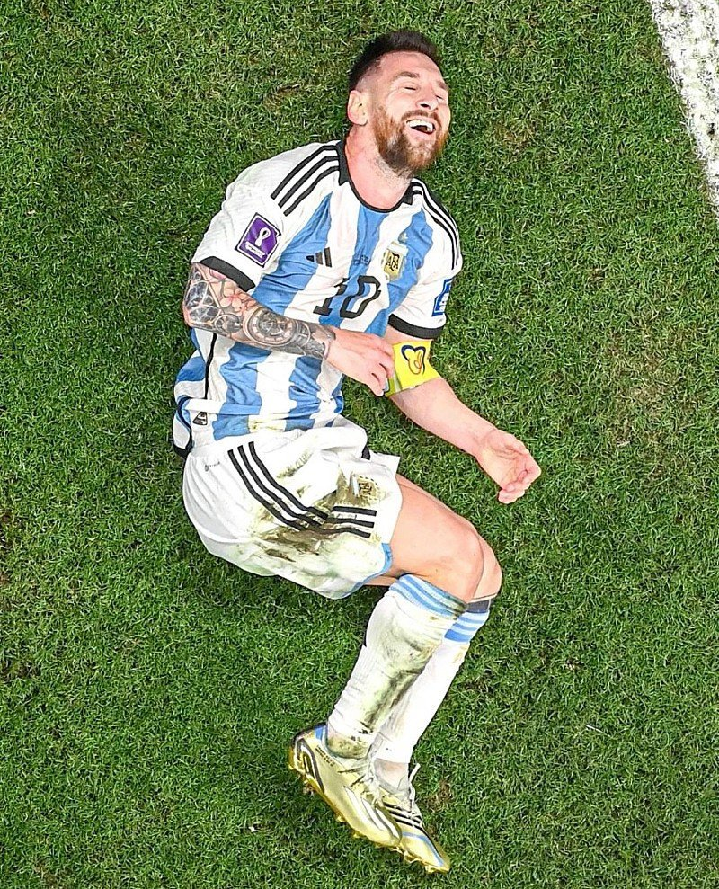

## 끝난 줄 알았던 경기

초반 빠른 PK와, 역습을 통한 디마리아의 골이 나왔을 때만해도 그리고 사실 80분을 향해 갈 때도 무난한 아르헨티나의 완승이 예상됐다.



하지만 PK와 음바페의 원더풀 골이 나온 뒤 경기 흐름은 프랑스로 가는 듯 했다.

연장적으로 향했고, 연장 후반 3분 메시의 추가골이 나오는 순간 무난하게 이기는 듯 했지만, 팔에 볼이 닿는 불운으로 PK를 내줬고 결국 승부차기로 향하게 됐다.

승부차기 끝에 아르헨티나가 우승했고, 메시의 마스터 피스인 월드컵을 드디어 들어올리게 됐다.

메시는 정말 메신, 메갓, 메시아가 되었다.

클루이베르트 시절부터 바르셀로나 팬이던 나에게는 너무나 감동적이고, 감격적인 결과였다.

이로써, 펠레와도 비견될 GOAT가 된 메시!

축하한다!

## 월드컵 우승 기념 사진

