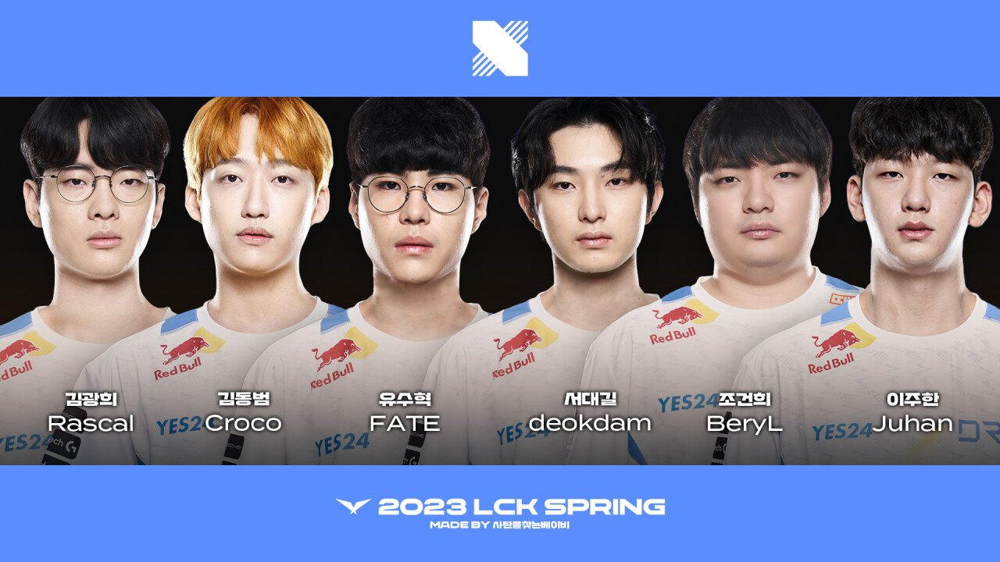
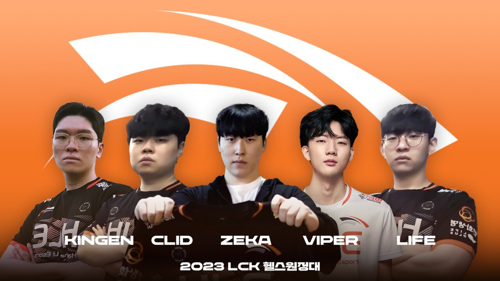
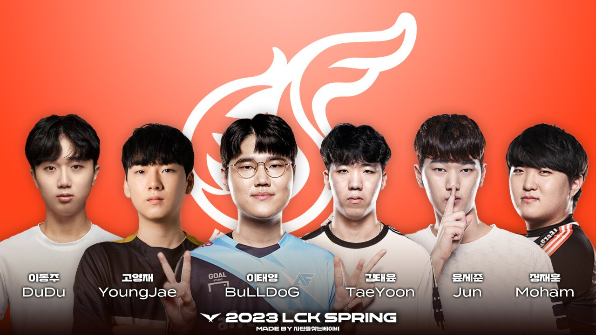
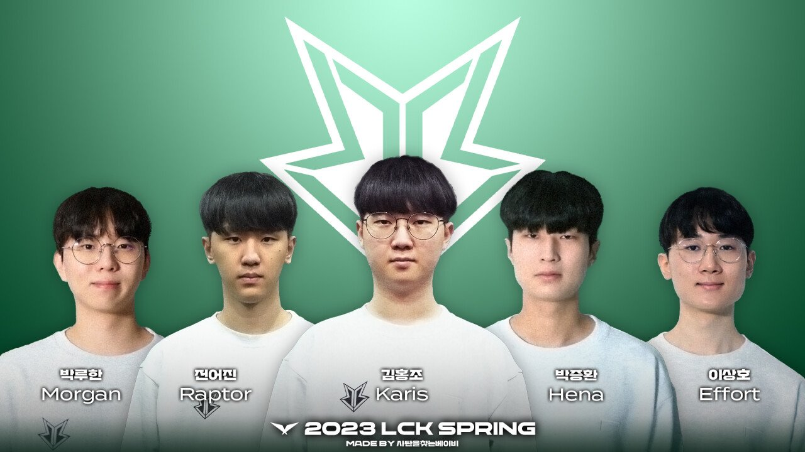

# 팀 별 분석

## GEN G

### 1승 (DRX) 1패 (T1)

T1을 만나 1패를 했고, DRX를 만나 1승을 했다.
1패도 T1의 저력이 아니었으면 하는 아쉬움과 경험이 부족한 점을 감안하고, 최상위권 팀에게 진 것은 그럴 수 있는 상태가 아닐까 싶다. 아무래도 바텀이 바뀌었으니...

DRX와의 경기를 완승한 것은 아주 큰 의미가 있을 듯?

2주차에 한화 생명을 이긴다면 3~4위권은 할 수 있지 않을까 기대된다.

## T1

### 2승 (GEN G, KT)

젠지와의 경기는 흔들렸지만 뒤집었으며, KT와의 1세트를 내주고도 뒤집었다.

확실히 3시즌 가까이 합을 맞춘 팀에, 지난 롤드컵도 한 끗 차이였던 팀의 완성도를 여실히 보여주는 듯.

T1은 황은 확정인 걸로 보여지고, 몇황인지가 관건 일 듯

## DK

### 2승 (DRX, BRO)

칸나도 자원 먹는 만큼 잘해주는 데다가, 데프트는 자신감과 함께 기량이 올라온 느낌? 

미드 정글은 말 할 것도 없고...

T1과 마찬가지로 황의 자리를 예약했다고 봐도 무방할 것

## DRX

### 2패 (DK, GEN G)

크로코는 뭔가 합이 안맞는 듯한 모습을 보여줬고, 페이트도 애매한 모습, 덕담 베릴도 아직 합이 맞지 않는 모습이었다.

그럼에도 자리를 잡고 플옵권은 가리라는 예상이 있긴 하지만, 아닐 수도 있겠다는 예상도...?

## HLE

### 1승 (KDF) 1패 (LSB)

광동과의 승리도 쉽지 않았는데, LSB와의 경기는 업셋이 나와버렸다.

칼챔 메타에서 좋은 모습을 보이지 못하고, 정규 시즌에선 애매할 떄가 많았던 킹겐의 불안감과 그보다 더 불안한 클리드가 문제다.

바이퍼 라이프도 아직 좋은 합을 보여주지 못했고, 제카만 상수다.

과연 다음 주에 젠지 전을 이길 수 있을까? 쉽지 않을 듯

## KT

### 1승 (농심) 1패 (T1)

T1전은 졌지만 1세트를 따냈고, 농심 전도 위험했지만 2, 3세트 안정적인 경기력을 보여줬다.

Bdd가 좋은 모습을 보여주고, 기인도 좋은 컨디션을 보여줘 플옵권은 갈 거 같은 예감이 든다.

## KDF

### 2패 (HLE, BRO)

HLE전에서는 좀 무기렸했지만, BRO 전에선 가능성을 보여줬다.

아직 좀 모자른 감이 많긴하지만, 두두가 역시 굉장한 친구.

좀 더 지켜보면 재밌게 흘러갈 수도 있을 듯?

## BRO

### 2승 (NS, KDF)

2승이지만, 대진이 좋았다는 느낌?

전력에 대한 평가는 좀 더 지켜봐야 할 것 같다.

## NS

### 2패 (KT, BRO)

KT전에서 1세트를 따냈지만, 사실 시즌 내내 어렵지 않을까 싶다.

과연 업셋을 얼마나 일으켜 줄 수 있을까?

## LSB

### 1승 (HLE) 1패 (DK)

아니... 한화를??

킹겐이 아쉬운 것도 분명 보였지만, 버돌이 포텐이 터져가는건가 싶은 경기력, 윌러와 클로저도 잘해주고 있고, 바텀도 기대보다 훨씬 좋은 모습을 보였다.

의외의 복병으로 플옵권도 가능 할 지도...?

# 총평

시즌 초반이지만, 예상과 비슷한 모양새를 띄는 듯 하다.

황 - T1 -> T1, DK
강 - KT, GEN G, DK -> KT, GEN G
중 - DRX, HLE -> DRX, HLE, LSB, BRO
약 - KDF, BRO, LSB, NS -> KDF, NS

1주차 후 소감이다.
다음 주 매치업 중 GEN G, HLE전이 HLE와 GEN G가 강의 자리를 증명 할 수 있을지 볼 수 있는 경기가 될 것 같다.
