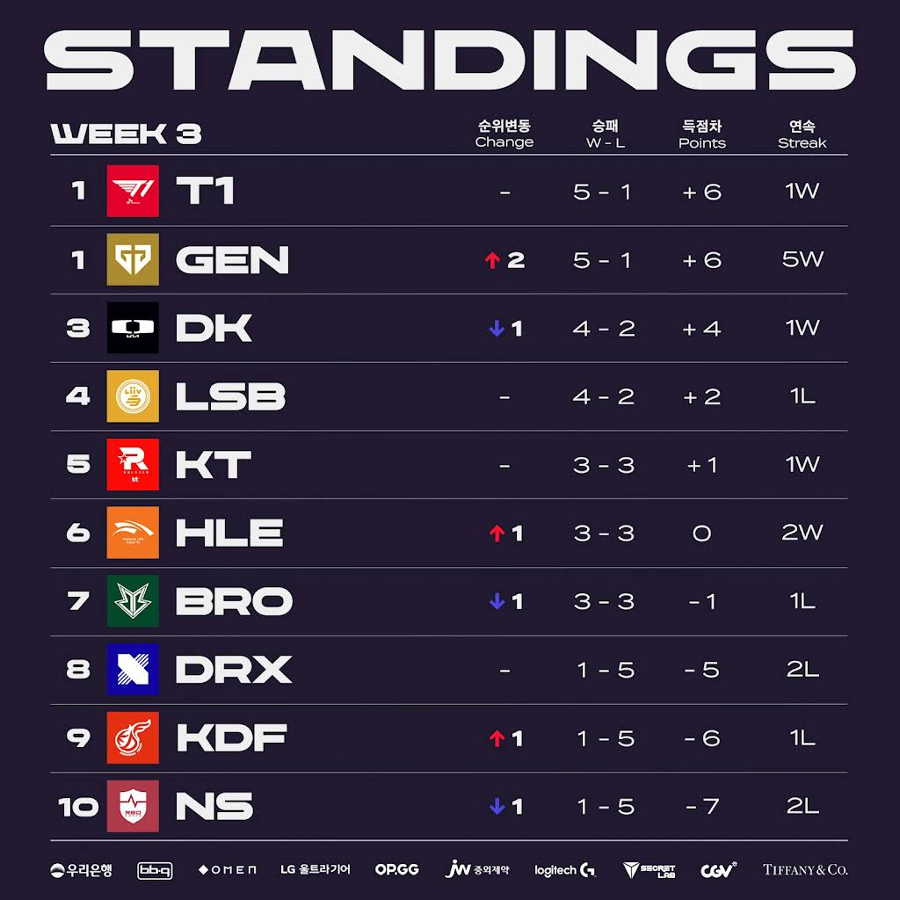
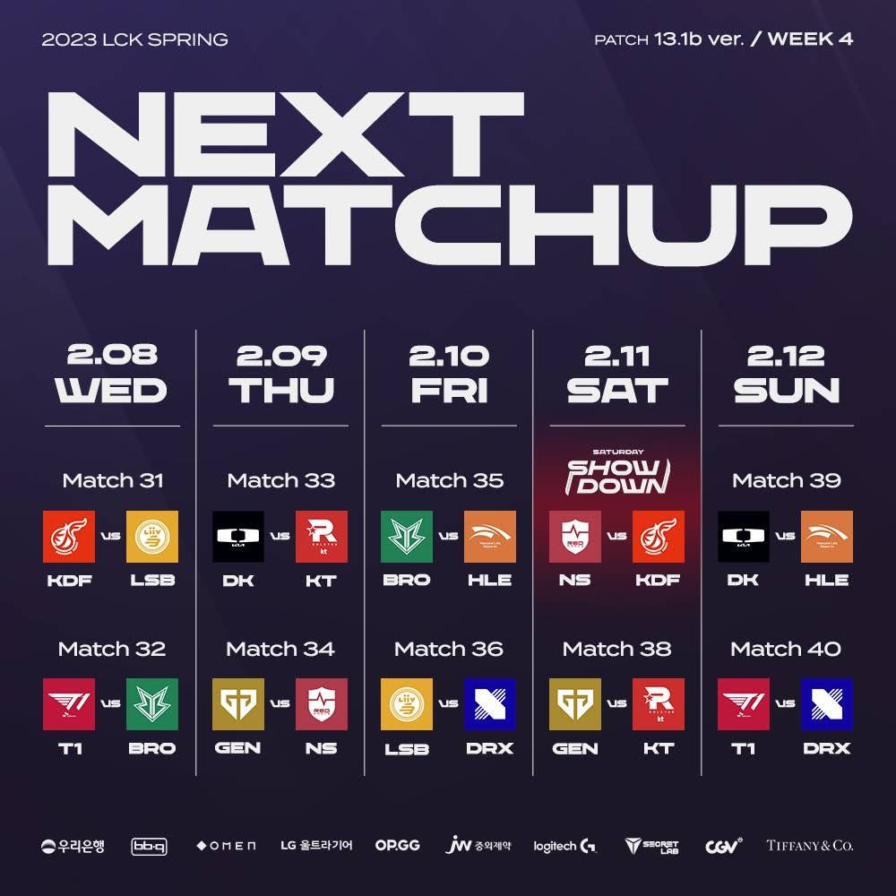

# 순위표

# 주간 매치업

# 팀 별 분석

## T1

### 1승 (NS) 1패 (HLE)

한화에 패배하며 전승은 끝났다.
농심전도 쉽지 않았으며, 이번주 경기력이 전반적으로 흔들렸다.

그럼에도 상위권은 확실히 가겠지?

## GEN G

### 2승 (DK, LSB)

DK까지 잡으면서 황의 위치를 넘볼 수 있게 됐다.

LSB와의 경기도 위기가 있었지만 뚝심을 보여주면서, 오히려 저력있고 매력 있는 경기력을 보여준 것도 희망찬 요소 아닌가 싶다.

페이즈 딜라이트가 한타와 교전에서 잘 받아먹으며 무난하게 승리를 챙기고 있다.

그럼에도 상체의 판단, 파괴력, 교전 능력이 압도적인 것이 이 성적의 원동력 아닐까?

## DK

### 1승 (KDF) 1패 (GEN)

GEN에게 1세트도 못따내면서 조금 우려가 되는 측면이 있는 듯 하다.

한타에선 예술적이지만 라인전에선 삐끗하는 면이 있는 도란을 상대로 칸나가 썩 좋은 경기력을 보이지 못했다.

KDF와의 경기에서도 삐끗할 뻔 한 것 보면, 어떻게 흘러갈지 궁금하다.

## LSB

### 1승 (NS) 1패(GEN)

GEN와의 경기를 졌지만 경기력이 좋았다.

충분히 서부에 위치할 자격이 있다는 것을 증명했다.

## KT

### 1승 (BRO) 1패 (KDF)

광동에게 한 세트도 못따내면서 완패를 당했는데, BRO에게는 위기가 있었으나 압승을 했다.

알쏭달쏭한 팀 경기력, 조금 무리하거나 한 끗 아쉬운 면도 많이 보여주고 있음.
그럼에도 선수진이 화려해서 플옵은 가지 않을까?

## HLE

### 2승 (T1, DRX)

T1을 잡아내는 이변을 만들내며, 반등을 시작했다. 킹겐이 칼챔을 포기하자 경기력이 급격히 좋아졌다.

킹겐이 한타 각도 잘 보고, 메이킹에 장점이 있는데 챔프의 난이도나 숙련도에 따라서 기복이 꽤 큰 선수가 아닌가 싶은 생각도 들었다.

HLE와의 경기가 오히려 기대보다 아쉬운 면모를 보여주면서 위기를 겪는듯 했으나 결국 승리했다는 것이 중요했다.

## BRO

### 1승 (DRX) 1패 (KT)

이 팀도 알쏭 달쏭... 그럼에도 이길 만한 상대를 잘 잡고 있는 것 같다.

플옵 턱걸이가 가능 할 수도...?

## DRX

### 2패 (BRO, HLE)

또 2경기 모두 졌다.

여전히 라스칼 이외의 선수의 경기력이 너무 올라오지 않는다.

바텀이 중요한 메타에서 덕담 베릴의 폼이 안좋은 것도 크게 영향을 주는 모양새.

## NS

### 2패 (LSB, T1)

패를 쌓아가며 성장 경험치를 먹는 중일텐데, 나쁘지 않은 경기력을 종종 보여주고 있다.

의적, 도깨비 팀의 면모를 얼마나 보여 줄 수 있을지 궁금하다.

## KDF

### 1승 (KT) 1패 (DK)

KT를 잡았다. 그리고 DK전에서도 나쁘지 않은 경기력을 보여주면서, 반전을 노려볼만한 경험을 쌓는 중인 듯 하다.

쉽지 않겠지만, 씨맥의 매직을 올 한해 내에 볼 수 있을까?

# 총평

티젠? 2황?

* 황 - T1 -> T1, GEN
* 강 - DK, GEN, LSB -> DK, LSB
* 중 - KT, HLE, BRO -> KT, BRO
* 약 - HLE, DRX, KDF, NS -> DRX, KDF, NS

3주차 후 소감이다.

* 4주차 매치업
    

4주차에는 DK VS KT 전, GEN VS KT 전, DK VS HLE 전이 기대 된다.
KT에게는 위기이자 기회인 매치업이다.