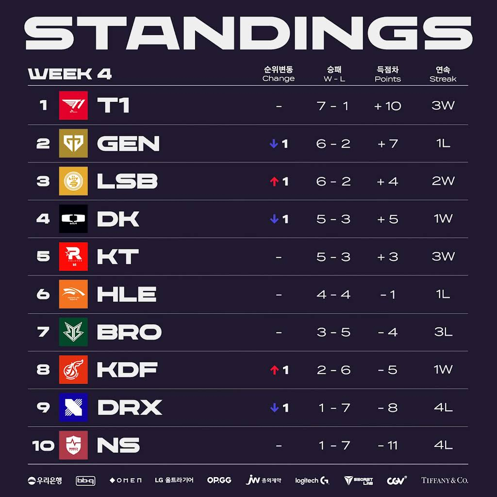

# 순위표

# 주간 매치업

# 팀 별 분석

## T1

### 2승 (BRO, DRX)

상대적 전력 열세인 두 팀을 쉽게 잡아냈다.

무난 했던 한 주

## GEN G

### 1승 (NS) 1패 (KT)

KT에게 일격을 당하며 2위로 밀려났다.

중요한 순간 한 끗씩 빛나가는 모습, 도란의 슈퍼플레이를 노리다가 넘어지는 모습, 딜 각을 잘 못잡았던 페이즈, 아쉬운 유미 밴픽 등이 맞물렸다.

과연 5주차의 KDF, T1전을 잘 치를 수 있을까?

## LSB

### 2승 (KDF, DRX)

하위권 팀들을 무난하게 잡는 모습은 플옵은 따논 당상.

강팀과의 경기들까지 잘 치룬다면 2위까지 노려볼 수 있어보인다.

## DK

### 1승 (HLE) 1패 (DK)

KT에게 패하며 경기력에 의구심을 샀지만, HLE를 깔끔하게 잡아냈다.

칸나가 기인 고사를 망친것 뿐일까, 아니면 전반적인 DK의 경기력이 아직인 것일까?

## KT

### 2승 (DK, GEN)

광동에게 완패한 팀 맞아?

DK, GEN을 잡아내며 상위권 도약에 성공했다.

충분히 2라운드 반전을 통해 상위권 결과를 낼 수 있음을 보여준 한 주였다.

## HLE

### 1승 (BRO) 1패(DK)

T1을 잡아낸 팀 맞아? 

DK에는 완패

밴픽에 따라 경기력도, 경기 패턴도 단조로운 것이 문제인 모양새

## BRO

### 2패 (T1, HLE)

T1, HLE에 졌다.

HLE전에선 한 세트 따냈다지만, 강팀에 이기는 모습은 못보여주는 이상 플옵도 쉽지 않을 듯

## KDF

### 1승 (NS) 1패 (LSB)

NS와의 하위권 매치에서 승리했지만, LSB와 경기는 패배.

그럼에도 한 세트씩 따내는 모습, 이길 때 경기력도 조금씩 좋아지는 걸 보면 의외의 다크호스 일지도?

## DRX

### 2패 (LSB, T1)

또 2경기 모두 졌다.

라스칼마저 흔들리며, 무기력한 경기력을 보여주는 중

선수들의 네임 밸류나, 이전 시즌 경기력에 비해서 너무 아쉬운 경기력과 결과다

## NS

### 2패 (GEN, KDF)

GEN 전에서도 저력을 보여줬지만, 이는 GEN이 흔들린 느낌이었나보다.

KDF전에서 패배하며 최하위권에 머무르고 있다.

# 총평

T1의 질주. KT의 반등

* 황 - T1, GEN -> T1
* 강 - DK, LSB -> GEN, LSB, DK, KT
* 중 - KT, BRO -> HLE, BRO
* 약 - DRX, KDF, NS -> KDF, DRX, NS

KT의 반등이 무섭다.

5주차 매치업에서는 T1, GEN의 리매치가 기다리고 있는데 GEN의 경기력이 4주차에 좋지 않았음을 미루어볼 때 완패가 걱정되는 상황이다.

* 5주차 매치업
    

이외에도 LSB와 T1전, LSB와 DK전이 기대 되는데 과연 LSB가 황에 근접할 수 있을까?

그럴 수도 있을 것 같다.