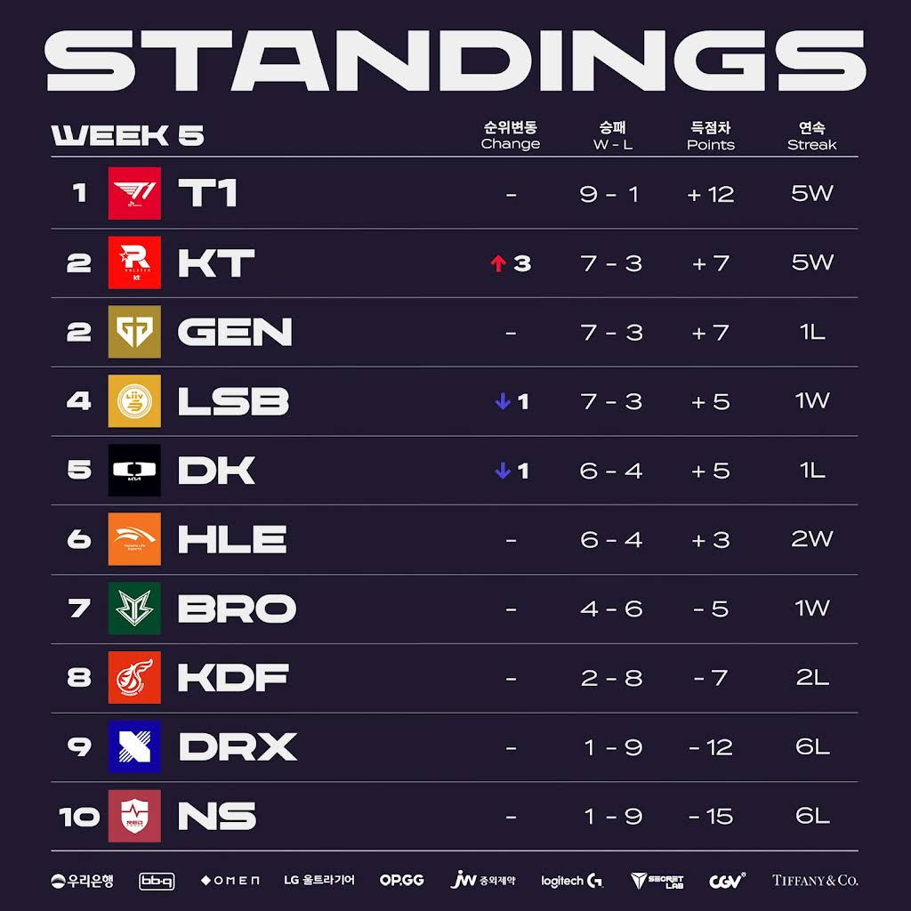
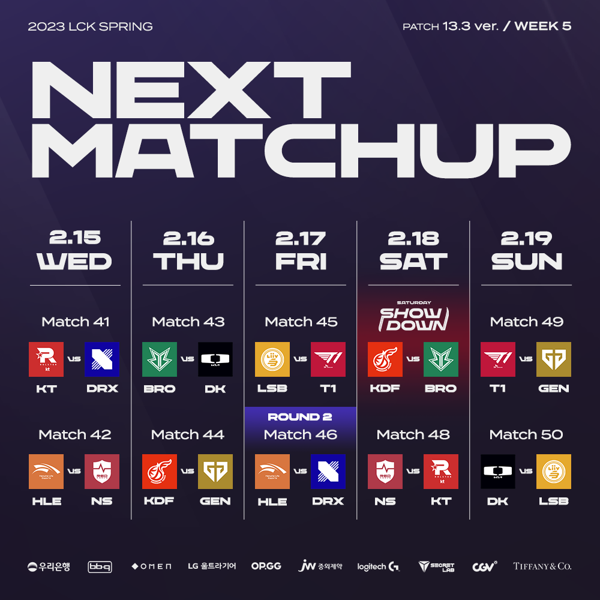

# 순위표

# 주간 매치업

# 팀 별 분석

## T1

### 2승 (LSB, GEN)

힘들었지만 해냈다.

특히 LSB 전도, GEN 전도 쉽지 않은 경기였고 질만했는데 이겼다.

이런 경기를 해내고 나면, 분명히 자신감도 올라가고 심리적 우위에 선다.

이번 시즌... 또 T1일 확률이 높아지는 듯

## GEN G

### 1승 (KDF) 1패 (T1)

아쉽다. KDF전도 쉽지 않아서, T1전이 걱정이었는데 생각보다 잘했다.

3경기 잡을만 했는데, 피넛이 두번 짤리면서 경기가 날라갔다.

하지만 피넛이 팀 전력의 핵심이고, 이 상황까지 끌고왔던 것도 피넛 덕분인 것을 감안하면 아쉬울 따름.

하지만 이런 경기력이면 포스트 시즌 해볼 만 할 지도?

## LSB

### 1승 (DK) 1패 (T1)

DK를 압도했다.

T1에게 졌지만 저력도 보여줬기에, 포스트 시즌은 확정이며 순위 싸움이 남은 모양새.

매섭다...

## DK

### 1승 (BRO) 1패 (LSB)

하위권만 이기는 느낌

DK가 강팀 판독기 느낌이 될 줄이야...

상위권 팀에게 매번 차이가 나는 경기력을 보여주고 있는데, 반등이 가능 할 까?

## KT

### 2승 (DRX, NS)

하위권 팀 깔끔하게 잡아내며 상위권 도약 성공했다.

이 경기력이면 T1전도...혹시...??

## HLE

### 2승 (NS, DRX)

DK랑 비슷하게 강팀 판독기 느낌이 남

2라운드 강팀들과의 경기력이 포스트 시즌의 성패를 예상하게 하는 포인트가 될 듯?

## BRO

### 1승 (KDF) 1패 (DK)

포스트 시즌은 힘들어보이고, 섬머를 대비한 경기력을 끌어 올리는 것이 관건 일듯

## KDF

### 2패 (GEN, BRO)

BRO에게도 지면서, 포스트 시즌은 물건너 갔다.

경험치는 잘 먹고 있는 것 같기도 한게, 세트는 종종 따내는 점은 희망적

과연 씨맥의 마법은...?

## DRX

### 2패 (KT, HLE)

또 2경기 모두 졌다.

정글러 문제라고 보긴 어렵지만, 시도해 본 주한 교체는 답이 아닌 듯.

바텀 폼도 안좋고 라스칼도 흔들린다.

미드도 뭐...

이전 시즌에 잘했던 선수들이기에 섬머를 대비하면서 경기력을 끌어 올리는 것이 중요하겠다.

## NS

### 2패 (HLE, KT)

역시나 희망은 없고, 스프링 경험을 바탕으로, 섬머에서는 달라진 모습을 보여 주는 것이 중요할 듯.

# 총평

T1의 집중력, 뒷심.
KT vs T1전도 해낼 수 있을 것인가?

* 황 - T1 -> T1
* 강 - DK, LSB -> GEN, LSB, KT
* 중 - HLE, BRO -> DK, HLE
* 약 - DRX, KDF, NS -> BRO, KDF, DRX, NS

T1에게 남은 고비는 거의 다 지나갔지만, T1을 제외하고 경기력이 가장 좋은 KT전이 남았다.

KT는 과연 해낼 수 있을까?

* 6주차 매치업
    

KT vs DK전과, T1 vs LSB전도 기대 된다.

과연 이번 시즌은 어떻게 될까?