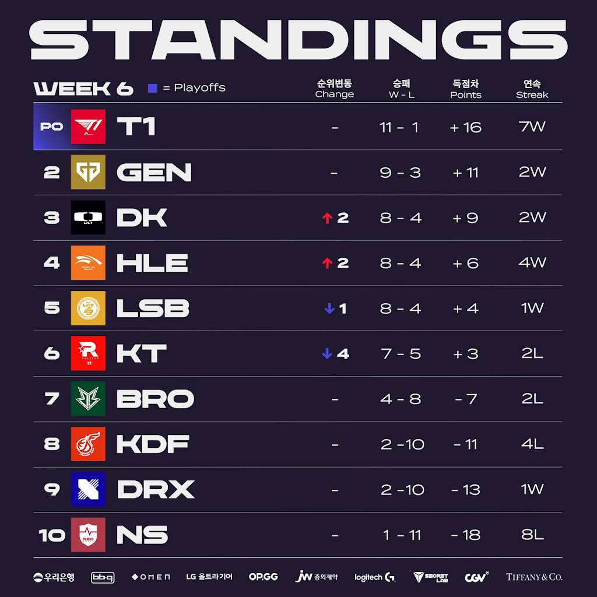
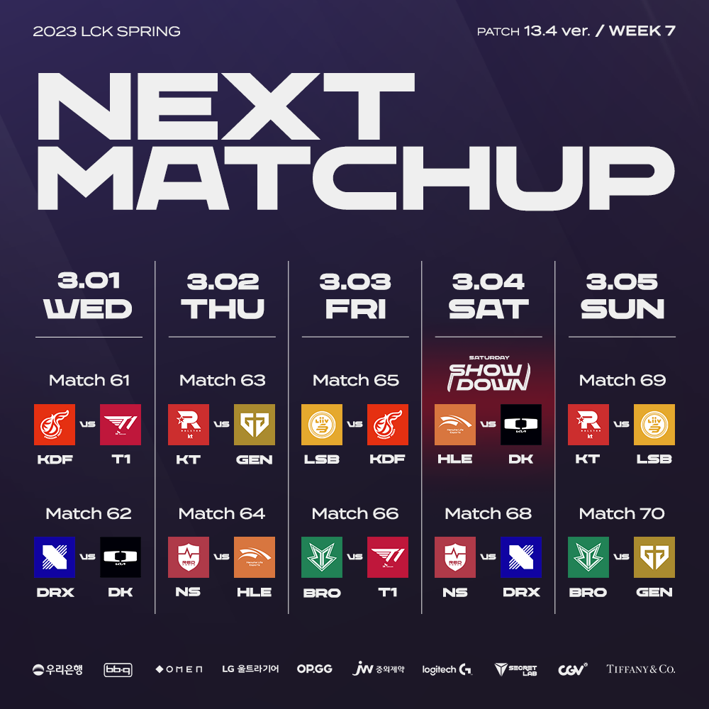

# 순위표

# 주간 매치업

# 팀 별 분석

## T1

### 2승 (KT, LSB)

지난주에 힘들었던 느낌이 있었는데 이번주엔 깔끔히 해냈다.

아마도 이번 시즌의 고비는 포스트 시즌에서의 젠지, DK 정도 아닐까 싶을 만큼 쉽게 잡아냈고 차이를 느끼게 했다.

포스트 시즌 확정이지만, 2라운드 확정은 아니지만, 사실상 2라운드도 확정이나 다름 없는 느낌

## GEN G

### 2승 (NS, DRX)

하위권 팀은 깔끔하게 잡고 있다.

2라운드 진출을 위해선 상위권 팀 들과의 남은 경기에서 얼마나 해내는 지가 관건 일 듯

## DK

### 2승 (KT, KDF)

고점의 KT였던 건가, DK가 잘하는 건가? KT전은 압승.

체급에서 오는 저력으로 포스트 시즌은 가겠지만... 상위권 팀과의 경기를 좀 더 지켜봐야 할 듯

## HLE

### 2승 (BRO, KDF)

마찬가지로 하위권 팀을 쉽게 이기고 있다

## LSB

### 1승 (NS) 1패 (T1)

아쉬웠던 1라와 달리 2라운드의 리매치에서는 무너졌다.

예상보다 잘해주고 있는 것은 맞지만, 조금 힘이 빠진 느낌?

## KT

### 2패 (DK, T1)

애매한 픽밴의 KT?

저점의 KT?

들쭉날쭉한 경기력... 아쉽다.

## BRO

### 2패 (HLE, DRX)

계속 한 끗이 모자른 느낌

하위권의 DRX에게도 지면서, 포스트 시즌은 멀어졌다.

## KDF

### 2패 (DK, HLE)

마찬가지로 들죽 날쭉한 경기력

DK전은 꽤 잘했는데, HLE전은 많이 부족했다.

## DRX

### 1승 (BRO) 1패 (GEN)

BRO에게 이기면서 1승을 더 챙기긴 했는데...

깔끔한 승리도 아니고 마찬가지로 많이 모자른 경기력

서머를 기대할 수 있나?

## NS

### 2패 (GEN, LSB)

몇주동안 그래도 꽤 괜찮은 세트도 있었던 것 같은데, 패배가 누적되면서 더 꼬이는 중일까?

경기력이 애매하다.

# 총평

T1의 질주.

KT가 2패를 당하면서 그대로 내려앉았다.

* 황 - T1 -> T1
* 강 - GEN, LSB, KT -> GEN, DK, LSB, HLE
* 중 - DK, HLE -> KT
* 약 - DRX, KDF, NS -> BRO, KDF, DRX, NS

다음주에는 KT VS GEN, DK VS HLE, KT VS LSB 전이 기다린다.

기세 좋던 KT였다면 승리가 기대 됐겠지만... GEN이나 LSB가 좀 더 승리 가능성이 높아보인다.

DK VS HLE전도, 두 팀이 스프링 챔피언에 도전할 전력인지 볼 수 있는 경기가 될 듯