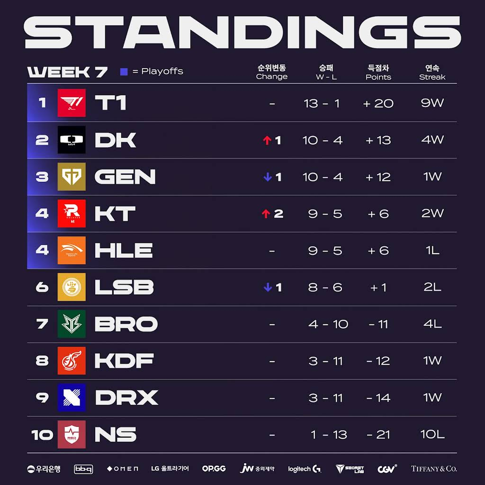
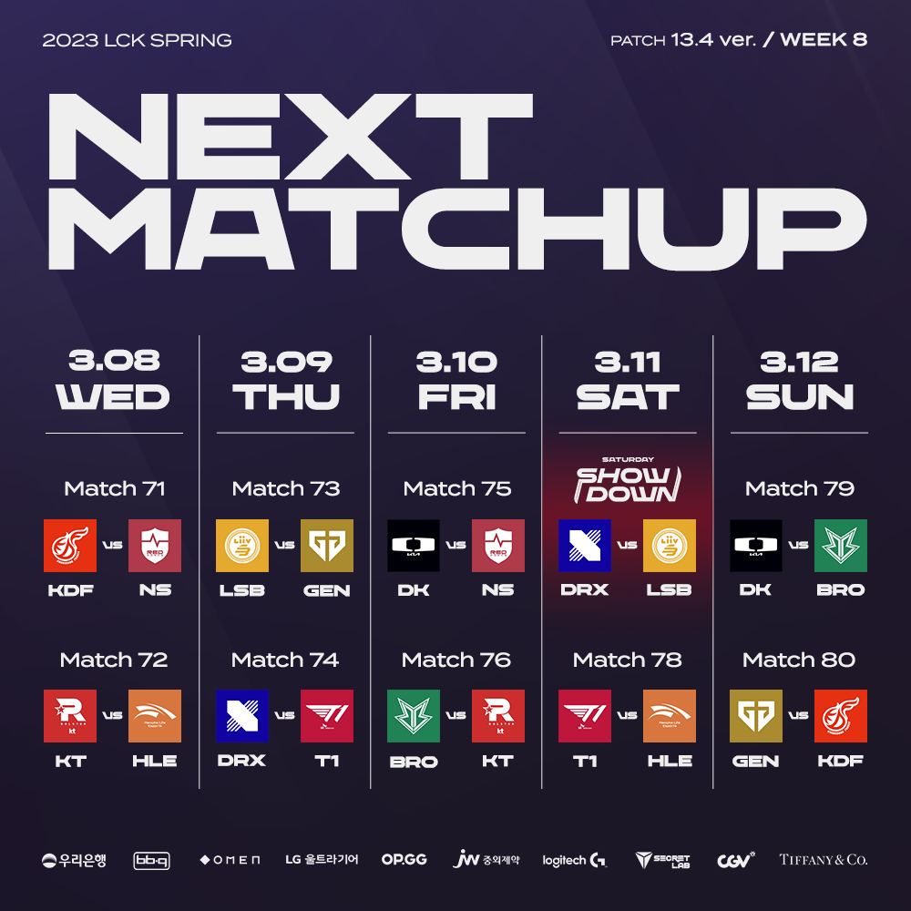

# 순위표

# 주간 매치업

# 팀 별 분석

## T1

### 2승 (KDF, BRO)

잘한다. 

1위로 직행 할 예정

## DK

### 2승 (DRX, HLE)

예상대로였던 DRX전과, 한화를 쉽게 제압하면서 2승으로 득실차 2위에 올랐다.

GEN전만 잘 치른다면 2위로 2라운드 직행을 바라 볼 수 있을지도?

## GEN G

### 1승 (BRO) 1패 (KT)

KT에게 또 졌다.

T1, KT 에게만 2번 다 패배하며 4패인데, DK전과 LSB전에 따라서 2위 가능성이 갈릴 거 같다.

## KT

### 2승 (GEN, LSB)

롤러코스터 같은 팀

밴픽을 크게 타나?

젠지도 결국 상성인가 싶은 경기력으로 이겨냈고, LSB를 쉽게 잡아냈다.

플옵은 확정이지만 이후 경기 결과들과 비슷한 승수의 팀들의 경기 결과에 따라서 2위가 가능할 수도 있을 듯

## HLE

### 1승 (NS) 1패 (DK)

연승을 이어가다 DK에게 패했다.

체급밖에 없다는 말이 나오지만, 그 체급도 후반 딜러 싸움까지 끌고 가서 한타로 승부 보는 원패턴 느낌이 너무 강하다.

경기력보다 승수를 선택한 느낌인데, 경기력을 결국 못 끌어 올리면 플옵에서 쉽지 않을 듯

## LSB

### 2패 (KDF, KT)

KDF에게 패하고, KT에게도 지면서 슬럼프인듯한 경기력이다

다음주 GEN에게도 지면 플옵에서의 결과가 걱정 될 지도?

## BRO

### 2패 (T1, GEN)

계속 애매한 경기력

엄티가 안타깝다

## KDF

### 1승 (LSB) 1패 (T1)

LSB를 잡아냈다. 플옵권 팀 중 가장 약체 아니냐는 말이 있어도, 그래도 상대적 강팀을 잡아내는 저력은 섬머를 기대하게 하는 하위권 팀!

역시 씨맥?

## DRX

### 1승 (NS) 1패 (DK)

계속 힘들다.

NS와의 경기도 그다지 쉽지 않았다.

섬머를 기대하기엔 많이 부족 한 듯

## NS

### 2패 (HLE, DRX)

은근히 1세트씩은 종종 따내는데 매치승까진 못하고 있다.

세트 완패 중인 꼴찌 팀은 아니라 긍정적으로 봐야 하는건가?

# 총평

1위는 사실상 확정

2위 및 플옵권 싸움이 주를 이루는데 어떻게 될까?

* 황 - T1 -> T1
* 강 - GEN, DK, LSB, HLE -> DK, GEN, KT, HLE
* 중 - KT -> LSB
* 약 - DRX, KDF, NS -> BRO, KDF, DRX, NS

다음주에는 KT VS HLE, T1 VS HLE 전이 기다린다.

KT는 이후 HLE 매치업은 하위권 팀 위주로 남게되고, GEN, DK, HLE은 플옵권팀 위주 경기가 많다.

2위를 차지해야 2라운드 직행인 만큼 누가 2위를 차지할지 궁금해진다.