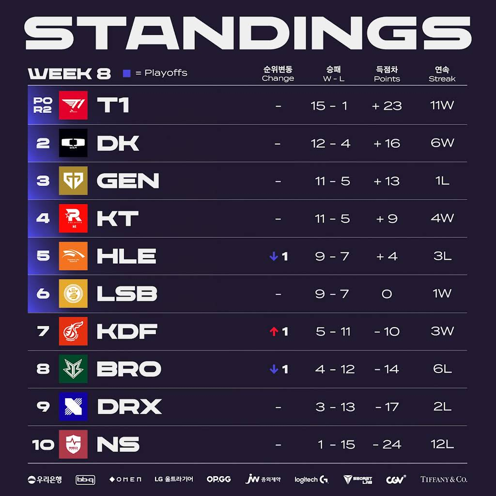
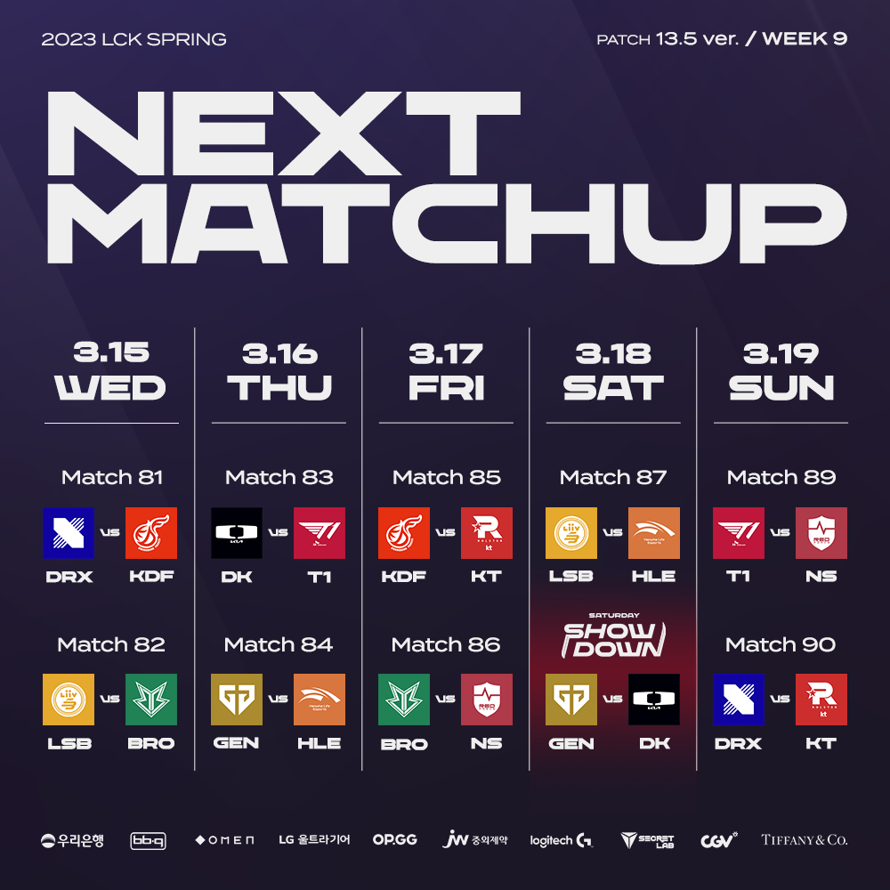

# 순위표

# 주간 매치업

# 팀 별 분석

## T1

### 2승 (DRX, HLE)

의견 없음. 플옵에서도 잘 할 듯?

한화와 약간 상성이 어긋나는 느낌도 있긴한데 그래도 너무 잘한다.

## DK

### 2승 (NS, BRO)

무난하다.

2위 경쟁에선 마지막 주 T1, GEN 경기가 남았는데 한경기라도 미끄러지면 KT가 2위일 확률이 높아보인다.

## GEN G

### 1승 (LSB) 1패 (KDF)

LSB는 상위 호환 모습을 보여주며 잡아냈지만, KDF와의 경기에선 아쉬운 모습을 많이 보여주면서 이변의 희생양이 됐다.

사실상 2위는 어려울 거 같고, 플옵 1라 준비를 해야 할 듯

## KT

### 2승 (HLE, BRO)

경기력이 물오른 느낌

3위 경쟁에 유리해졌으며, 경기력도 좋다.

광동에게 일격만 안맞으면 될 듯

## HLE

### 2패 (KT, T1)

강팀에겐 잘 못이긴다.

후반가면 우리가 이겨 원 패턴으로 플옵에서 괜찮을까?

## LSB

### 1승 (DRX) 1패 (GEN)

강팀에게 무난히 계속 진다.

플옵 1라에서도 질 확률이 높아 보임

## KDF

### 2승 (NS, GEN)

GEN도 잡아내면서 연승행진?

경기력도 좋아지고 있음

섬머를 기대해도 되나?

## BRO

### 2패 (KT, DK)

초반의 연승은 대진운?

계속 진다.

## DRX

### 2패 (T1, LSB)

뭔가 계속 안된다.

선수 교체를 시도해보지만 궁여지책인 듯

## NS

### 2패 (KDF, DK)

1라가 더 잘했던 거 같은 기분은 뭘까?

# 총평

1위 확정에, 2위 경쟁도 KT가 유리해진 모양새
경기력을 봤을 때 2라운드 대진까진 어느정도 예측된다.

* 황 - T1 -> T1
* 강 - DK, GEN, KT, HLE -> DK, GEN, KT
* 중 - LSB -> HLE, LSB, KDF
* 약 - BRO, KDF, DRX, NS -> BRO, DRX, NS

마지막 주다.

DK VS T1, GEN VS HLE, KDF VS KT, GEN VS DK, LSB VS HLE 등 기대 되는 매치가 많다.

특히 플옵권 팀끼리 순위가 사실상 결정 된 상태에서 기세 몰이 혹은 메타 검증 등 다양한 가능성이 엿보인다.

2위는 미정인 만큼 DK가 과연 T1을 잡아서 2위가 가능할지 궁금하다.