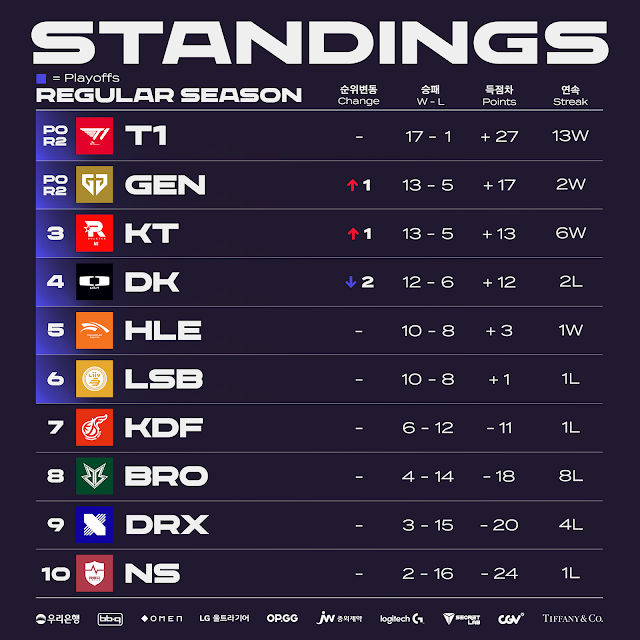
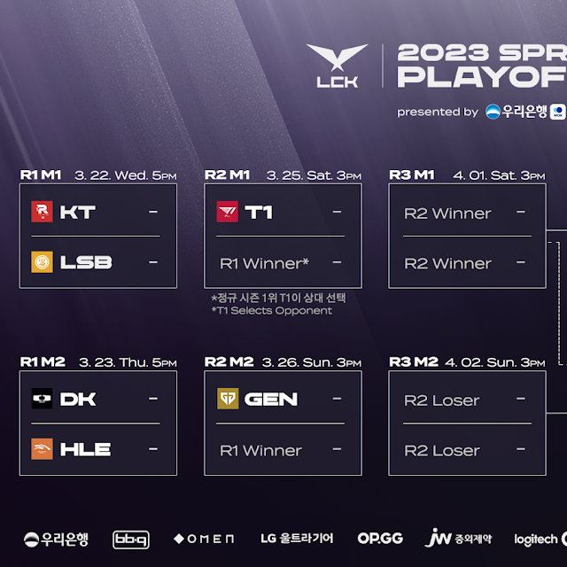

# 스프링 정규 시즌 최종 순위표

# 주간 매치업

# 팀 별 분석

## T1

### 2승 (DK, NS)

DK도 압살했다.

차이를 보여주며 순위 확정에도 방심 없는 승리

## DK

### 2패 (T1, GEN)

2위 경쟁에서 미끄러지며 4위로 떨어졌다.

젠지전도 결국엔 역전을 허용하며 후반 뒷심과 합이 아쉽다.

플레이 오프도 쉽지 않을 듯

## GEN G

### 2승 (HLE, DK)

한화와 DK를 모두 잡아내며 낮은 확률을 뚫고 2위로 시즌을 마감했다.

KT, T1과의 전패, 광동 전 패배가 아쉽지만 플옵 2라운드로 직행한 만큼 2번의 기회를 잘 살려볼 수 있겠다.

## KT

### 2승 (KDF, DRX)

역시나 예상대로 전승을 거두며 2위와 승점차 3위를 기록했다.

경기력이 좋은 점이 고무적이고 후반기 포스는 훌륭했던 만큼 플옵에서도 선전이 기대된다.

## HLE

### 1승 (LSB) 1패 (GEN)

LSB전도 쉽게 이기지 못했으며, GEN 전에는 무너졌다.

아쉬운 경기력

플옵을 기대하기 쉽지 않은 마무리다.

## LSB

### 1승 (BRO) 1패 (HLE)

HLE처럼 강팀 판독기가 된 모양새

플옵...괜찮을까?

## KDF

### 1승 (DRX) 1패 (KT)

KT에겐 완패했지만, KT가 강했다고 봐도 될 듯?

분명 섬머에선 플옵 1라운드 진출은 가능한 팀이 된 거 같다.

## BRO

### 2패 (NS, KDF)

서부권 팀들에게도 연패

초반의 승점으로 마무리했으며, 발전도 못한 경기력은 아쉬울 따름이다

## DRX

### 2패 (KDF, KT)

어렵다. 마무리도 안좋았기에 섬머가 괜찮을지 우려된다.

## NS

### 1승 (BRO) 1패 (T1)

BRO을 잡아내며, 섬머에서 하위권 중에는 경쟁력을 보여줄...지도?

사실 쉽진 않을 듯 하다

# 총평

정해졌던 1위, 5~6위 (순위만 남았었음) 외에 2~4위 싸움의 승자는 GEN이 됐다.

KT가 3위가 되어 LSB를 선택했으며, DK는 자동으로 HLE와 붙게 됐다.

아마도 KT와 DK가 무난하게 올라오지 않을까 싶지만, 뚜껑은 열어봐야 아는 법

한주에 2라운드까지 치르기 때문에 T1과 KT VS LSB 승자, GEN와 DK VS HLE 승자가 붙는데 아무래도 2라운드 직행팀들의 승리가 정배로 보여진다.

더블 엘리미네이션으로 바뀌어서 플옵이 경기수가 많아 볼거리도 많아지고, 다전제 경험치와 반전을 이뤄낼 확률이 낮게라도 존재한다.

팬 입장에선 좋은 거 같고, 선수 입장에선 힘들 것이다.

그럼에도 MSI나 롤드컵 경쟁력을 위해선 좋은 경험같다.

강팀들 간의 경기, 그리고 다전제가 남은 만큼 재밌는 경기 기대해본다.