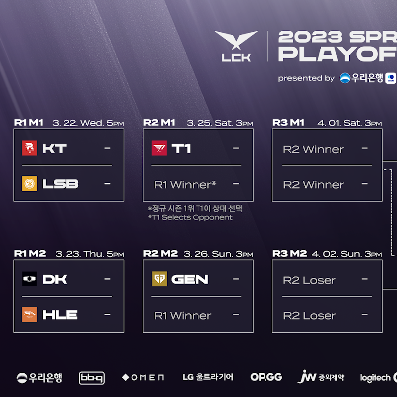
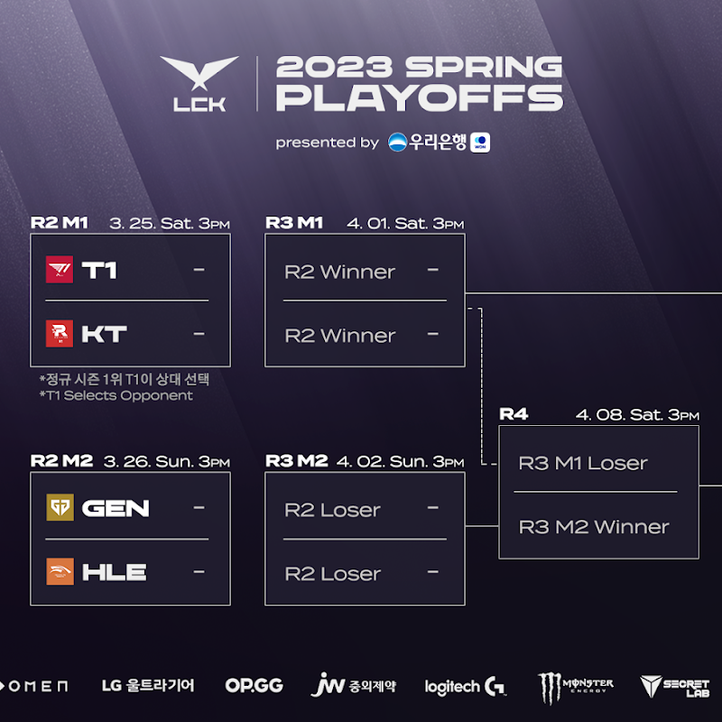

# PO Round 1, PO Round 2 매치업

# 1라운드

## KT VS LSB 

### 결과 KT 3 : 1 LSB

말그대로 압살했다.

큰 차이를 보이며 이변 없는 승리를 거두며 우승 후보급 전력을 보여줬다

## DK VS HLE

### 결과 DK 1 : 3 HLE

DK가 무기력하게 무너졌다.

특히 데프트의 줄타기 실수도 컸지만 전반적으로 경기력이 썩 좋지 못했다.

HLE가 잘한 것인지, DK가 못한것인지... 애매함이 보였던 경기

# 2라운드

## T1 VS KT

### 결과 T1 3 : 2 KT

KT는 만만치 않았다.

T1이 HLE를 고르는게 나았을 거라는 말이 나올 정도의 경기.

페이커의 클러치 플레이가 아니였다면 5 경기는 졌을 확률이 매우 높았다.

패자조로 떨어졌지만 KT와 리매치 결승 확률이 높아 보인다.

## GEN G VS HLE

### 결과 GEN G 3 : 1 HLE

빅 매치 헌터라는 칭호가 아까울 정도로 무기력하게 HLE가 패했다.

DK가 약해서 올라온 거 같다는 얘기가 나올 정도

더블 엘리미네이션인 만큼, 패자조가 있다지만 패자조에서 만날 KT를 꺾는 일은 쉽지 않을 듯 보인다.

# 3 라운드 예상

나는 GEN G와 KT 팬이기에, GEN G가 결승을 가고 KT가 패자조에서 올라오길 바라지만, 현실적으로는 T1이 결승을 가고 남은 자리에 KT와 GEN G가 붙을 것 같다.

아무래도 다져진 팀웍의 T1이 우승까지 차지할 확률도 높아보이는데, 우선 어느팀이건 박빙으로 경기력이 좋으면 좋겠다.