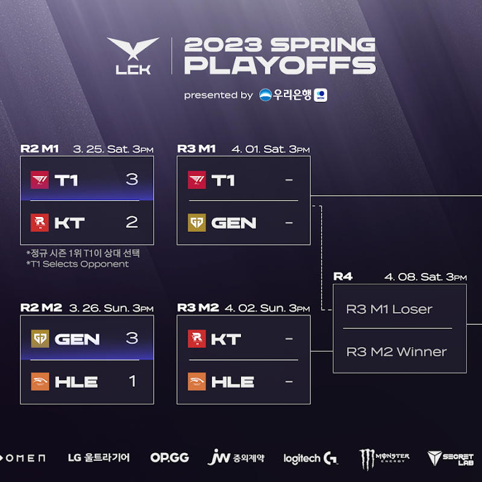
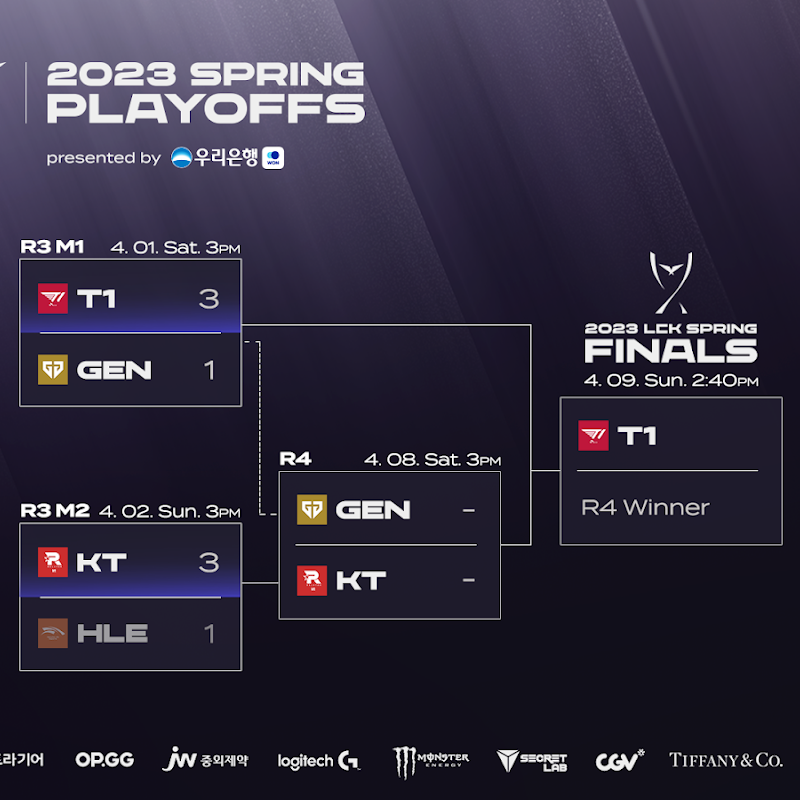

# 3라운드 매치업

# 승자조

## T1 VS GEN

### 결과 T1 3 : 1 GEN

T1은 역시 강했다.

특히 2세트의 집중력, 케리아와 구마유시가 해냈다.

도란의 경기력이 전반적으로 썩 좋지 못했으며, 피넛도 아쉬웠다.

바텀이 밀린 것도 전반적으로 아쉬웠음

그럼에도 2세트도 잡을 수도 있었고, 3세트도 힘들었고 비벼졌지만 이겼다는 것을 감안하면 이길 수도 있는 경기로 흘러갈 수도 있었다.

그럼에도 KT가 더 저력있는 모습을 보여왔기에 GEN G의 아쉬운 모습들을 생각해본다면 패자조 결승은 힘들지 않을까?

# 패자조

## KT VS HLE

### 결과 KT 3 :1 HLE

압살이다. 박빙의 경기가 없었던 것은 아닌데, 전반적으로 좋지 못했다.

꽤 잘해준 킹겐, 아주 잘해준 고통의 바이퍼 외에는 모두 그다지 좋지 못한 모습을 보였다.

특히 아주 소극적이던 제카, 실수 투성이 클리드가 눈에 띄게 아쉬웠다.

결국 DK가 약했고, GEN G도 강하기 보단 HLE가 전력상 열세였다는 평가로 이어질 수도 있는 경기였다.

반면 KT는 T1을 잡을 수도 있었기에 조금 더 고평가가 유지될 수 있겠다.

# 4 라운드 및 결승 예상

KT, GEN G 두 팀 다 팬인지라 아쉽지만 그럼에도 KT가 좀 더 우세하다고 생각한다.

KT가 T1을 꺾을 확률이 더 높은 것도 사실인 거 같고. (2라운드에서 보여준 것도 있고 말이다.)

그럼에도 우승은 T1 아닐까 싶은데, 그럼에도 나는 예상 외의 경기력과 결과를 기대해본다.