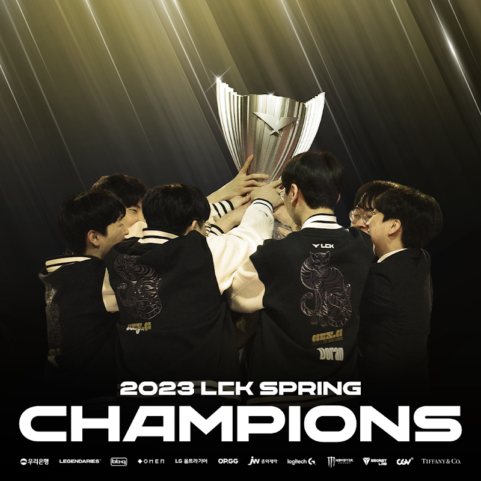

# 3라운드 매치업

#  결승

## GEN G VS T1

1, 2 세트 그라가스의 역대급 고점으로 2대0으로 앞서갔다.
그라가스 숙련도와 이해도가 역대급 고점인 것을 증명하듯 말이다.

1경기 제우스는 말린 제이스로 아쉬운 경기력을 보여줬고, 2세트 역시  제우스의 상징과 같은 케넨이 뭔가 해보지도 못하고 터지면서 장점을 보여주지 못했다.

적절한 사이온 로밍과 3세트 구마유시의 활약으로 이겼고, 4세트가 시작됐다.

4세트 초반 상태가 모두 망하면서 어려운 경기를 예고했는데, 2원딜, 2탱, 1유틸폿의 균형 잡힌 조합으로 한타력을 바탕으로 승리를 해냈다.

정배가 예상됐던 바텀에서 아주 잘해줬고, 제우스의 저점 경기가 꽤 나왔고 도란은 그라가스는 1~2경기 만점 활약을, 4경기 라인전은 삐끗해도 한타에서의 활약을 보여줬다.

피넛은 밴픽에맞는 적절한 활약을 보여줬으며, 쵸비 역시 챔피언에 따라서 필요한 적절한 플레이를 잘 보여주며 승리를 거둘 수 있었다.

특히 밴픽이 해야 될 플레이를 잘 수행해서 GDB식 밴픽도 긍정적 평가로 바꿀 수 있었다.

# 결과

## 매치 하이라이트



## 결승 인터뷰 & 트로피 세레모니



## 후기

GEN G는 고점을, T1은 반대로 저점을 여러번 띄웠다.

T1입장에서 3경기를 잡아냈지만, 반대로 진 1, 2, 4세트를 돌이켜보면 어떤 플레이를 해야 이길지에 대한 자신감이 GEN G가 더 좋았던 것 같다.

특히 현메타가 결국 후반을 많이간다는 것을 시즌 후반부터 예감한 것인지 중후반 가는 경기를 많이 지향했고 그러한 지향점이 라인전이 터지지 않으니 빛을 발한 것 같다.

결국 GDB식 밴픽이 옳았던걸까?

한달 후에 치뤄질 MSI에서의 메타는 어떻게 펼쳐질지 궁금하고, 두 팀이 나가는 만큼 T1, GEN G 모두 좋은 경기력을 보여줬으면 좋겠다.

## GEN G 칭찬

로얄 로더를 자신의 힘을 크게 더해 달성한 페이즈, 하위권 서폿이란 오명을 벗어던진 딜라이트 바텀 듀오의 성장이 우승의 원동력 같다.

여전히 불안하지만, 줄타기하면서 캐리 or 트롤을 하는 도란... 그럼에도 매력적이고, 다양한 롤을 다재다능하게 소화해내는 만능형 미드라이너로 거듭나고 있는 쵸비, 사령관 스타일로 거듭한 쵸비 모두 수고했다.

말이 좋아 디펜딩 챔피언이지, 도전자나 다름없던 입장에서 꽤 힘들었던 스프링을 다 이겨내고 (운이 좀 따랐던) 2위로 정규 시즌 마무리, 최종 결승 진출전(패자조 결승)을 통해 우승까지 해낸 GEN G 너무 멋졌다.

스코어, 마파, 무성 코치도 고생했고, 부디 MSI는 맘편히 즐기다 왔으면 좋겠다.

`2023 LCK Spring Final Winner Gen G!`

물론 우승하면야 좋겠지만, 어차피 우승 잘 못하던 MSI인데 롤드컵 전초전 느낌으로 다양한 시도와 경험을 쌓는 계기가 되면 좋겠다.

이젠 무관보다 유관이 어울리는 팀! Gen G가 롤드컵도 들어올리는 모습을 기대해 본다.