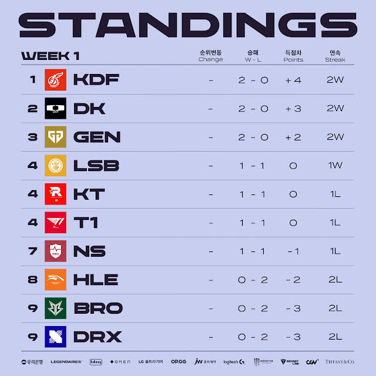
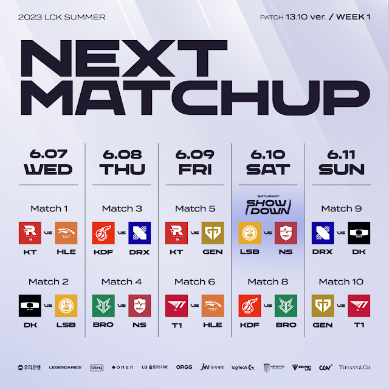

# 순위표

# 주간 매치업

# 팀 별 분석

## KDF

### 2승 (DRX, BRO)

상대적 스프링 약팀이었던 DRX, BRO 상대였다지만 좋은 경기력과 집중력을 보여줬다.

심지어 세트 스코어도 2:0 셧다운 두번!

씨맥의 원팀이 드디어 나오는건가?

## DK

### 2승 (LSB, DRX)

분명 잘한건 맞는데, 좀 더 두고봐야 하는 느낌?

상위권 팀 상대로 맥을 못추는 강팀 판독기 느낌에, 도깨비 팀 같은 면모도 못보여준지 조금 되서 더 지켜봐야 한다는 느낌이다

## GEN

### 2승 (KT, T1)

완벽했다고 보긴 힘들지만, 두 경기 다 좋은 집중력과 좋은 합을 보여주면서 승리했다.

특히 도란의 주사위 스러움이 있음에도 이겨주고 있는 팀의 저력 특히 페이즈의 활약이 돋보인다.

이번 시즌...또 일내나?

## LSB

### 1승 (NS) 1패 (DK)

1승 1패라지만 NS 상대 1승이라 좀 더 두고봐야 하겠다.

## KT

### 1승 (HLE) 1패 (GEN)

GEN 상대로 금지 아이템 구매로 인한 영향인지 무너지면서 패배했지만, HLE 상대로 좋은 경기를 보여줬다.

아마도 상위권이길 할 듯?

## T1

### 1승 (HLE) 1패 (GEN)

HLE 상대로 완승은아니었지만 차이를 보여줬다면, 지난 시즌 정규 시즌 마다 보여준 작지만 큰 차이는 GEN이 더 보여준 것 같다.

그럼에도 당연히 상위권 이겠지만, 정규 시즌의 압도적 성적이 어려워보이는 스타트다.

## NS

### 1승 (BRO) 1패 (LSB)

1승 1패라지만, BRO한게 이긴 거다.

승리 당한 느낌에 대진 순에 따른 1승 1패 느낌

## HLE

### 2패 (KT, T1)

2패지만 그래도 나름의 저력은 계속 보여줬다.
개인적으로 킹겐은 탱커 메타가 어울리는 것 같다.

아마도 플옵은 가겠지만...

## BRO

### 2패 (NS, KDF)

광동한테는 그렇다쳐도, NS에게 까지...

하위권 예약에 경기력도 좀 안타깝다.

## DRX

### 2패 (KDF, DK)

광동도 아마도 중위권 팀이 될 거 같고, DK가 상위권 팀이라지만 뭔가 많이 아쉽다.

완패를 당한거까지는 아니지만 경기력도 좋지 않으며 라스칼의 차력쇼 아니면 힘들 듯?

미드 원딜이 교체 된 것도 좋게 작용할지 의구심이 든다.

# 총평

시즌 초반이지만, 예상과 비슷한 모양새를 띄는 듯 하다.

* 강 - KDF (?), DK, GEN
* 중 - KT, T1, LSB, NS(?)
* 약 - HLE, BRO, DRX

## 2주차

* 2주차 예상
    

### 광동 VS GEN G

광동의 저력이 2주차의 GEN G 에게도 통할 것인가?

통한다면 강팀이 된 것이겠지만 과연...?

물론 스프링 2주차에 잡아 냈던 GEN G였지만...

### LSB VS T1, LSB VS KT

리브 샌박의 이번 시즌이 어떨지 판가름 지을 수 있는 두 매치가 될 것이다.

반전을 이뤄낼 수 있을까? 만약 리브 샌박이 반전을 이뤄낸다면 중위권, 상위권 흐름 자체가 바뀔 지도...?