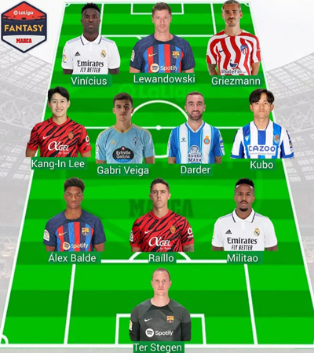

지난 시즌 마요르카의 에이스로 군계 일학의 활약을 보여준 이강인

분명 리그에서 손꼽히는 미드 필더로 성장했다는 것은 다양한 선정 결과로도, 경기 내용으로도 증명했다.

AT 마드리드로의 이적이 유력했으나, PSG에 더 가까워졌다는 보도가 나오고 있다.

라 리가의 상징으로 성장할 수 있지 않을까 하는 기대를 하기도 했는데, PSG라니..?

약팀에서도 이정도 활약을 보여준 선수가 강팀에서 더 훌륭한 모습을 보여줄 것이 기대되고 있었던 것은 사실이지만, PSG 레벨의 강팀에서 주전 경쟁을 잘 이겨낼 수 있을까? 우려가 되는 것도 사실이다.

그럼에도 이런 합성 사진도 나올 만큼, 많은 사람들이 큰 기대감을 품는 것 같다.





수 많은 스폐셜 영상 어떤 걸 봐도 매력적인 선수인데 과연, PSG가 정식 오퍼를 했고 가게 된 걸까?

루이스 캄포스의 픽이고 나겔스만도 영입 대상으로 고려한 선수라면 리그 앙은 물론 챔피언스 리그에서의 강팀들 상대로도 활약하는 이강인을 보기에 좋은 기회라고 생각한다.

물론 AT 마드리드에 비해서 적응도 필요할 것이고, 볼 소유 시간도 상대적으로 적어 질 수도 있겠지만 그럼에도 아웃 라이어인 PSG 행은 그 장점이 있고 기대 되는 측면도 있다.

이강인의 이적...어떻게 흘러갈까?
