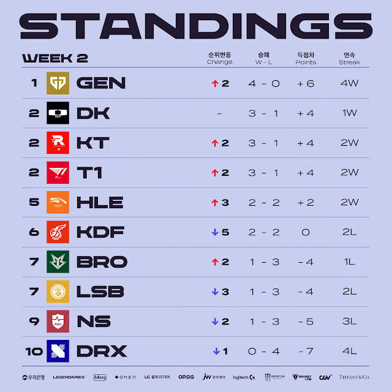
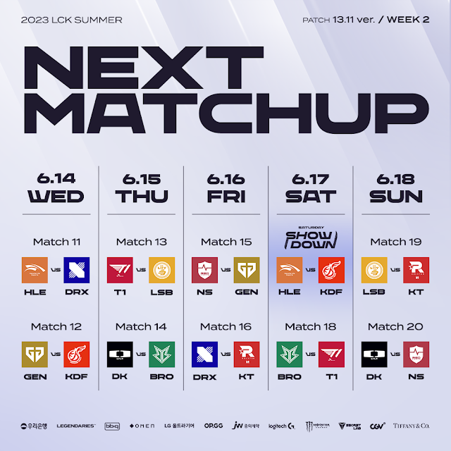

# 순위표

# 주간 매치업

# 팀 별 분석

## GEN

### 2승 (KDF, NS)

1위였던 광동도 쉽게, NS전도 역시나 쉽게 잡아내며 1황의 자리로 향해 가는 중

이견 없이 이번 시즌 우승후보다

## DK

### 1승 (NS) 1패 (BRO)

데프트가 빠졌다지만, 브리온에게 충격패를 당하며 주춤했다.

강팀과의 경기도 많이 남았는데... 플옵이야 가겠지만... 

## KT

### 2승 (DRX, LSB)

잘한다. GEN전도 잘한 부분도 많았던 만큼 역시나 섬머 우승 후보로 보여진다.

## T1

### 2승 (LSB, BRO)

마찬가지로 역시나 우승 후보에 근접했다.

GEN 전에서 졌던 충격이 오래가지는 않는 거 같고, 역시 중하위권 팀은 잘 잡는다.

## HLE

### 2승 (DRX, KDF)

DK와 마찬가지로 강팀 판독기 느낌이 찐하다.

분명 KDF도 잡아냈다지만... 좀 더 증명이 필요하다.

## KDF

### 2패 (GEN, HLE)

2패를 하긴 했지만, 우승 후보 GEN과 체급이 높은 HLE니까 이해할 수 있는 범주인듯

도깨비 팀의 면모를 조금 더 보여줄 수 있을까?

## BRO

### 1승 (DK) 1패 (T1)

T1에게 졌다지만, DK를 잡아낸 저력을 보여줬다.

리브 샌박도 지난 시즌보다 아쉬운 경기력인 만큼 HLE, 광동과의 플옵권 싸움을 잘 해낼 수 있을까?

## LSB

### 2패 (T1, KT)

강팀에겐 내리 지고 있다.

플옵...가능할까?

## NS

### 2패 (GEN, DK)

강팀에게 맥을 못추는 모습을 시즌 내내 보여주지 않을까 싶다.

전반적인 밴픽, 인게임 경기력 모두 어중간한 이유는 전력 자체의 영향일까, 팀합의 영향일까?

## DRX

### 2패 (HLE, KT)

유일 전패의 팀이다.

파덕이나 예후 같은 신인을 기용한 것이 독이 되는 중일까?

빛이 나던 라스칼도 평범한 하위권 탑솔러가 되어가는 것이 안타깝다.

# 총평

예상과 비슷하지만, BRO가 날린 일격과 DRX의 전패가 인상적이다.

* 황 - 없음 -> GEN
* 강 - KDF (?), DK, GEN -> DK, KT, T1
* 중 - KT, T1, LSB, NS(?) -> HLE, KDF
* 약 - HLE, BRO, DRX -> BRO, LSB, NS, DRX

## 3주차

* 3주차 예상
    

### KT VS DK

상위권 싸움인 만큼, 정규 시즌의 향방이 어느정도 보이는 경기가 될 것 같다.

내 예상은 KT가 더 좋은 모습아닌가 싶다.

특히 칸나가 기인, 도란, 제우스 만큼의 경쟁력을 보여주지는 못하는 것 같다.

### DK VS GEN

DK가 KT전을 졌다면, 이 경기까지 지면 중위권이 될 확률이 매우 높아진다.

GEN가 승패도 승패지만 경기력도 황의 면모를 보여주는 만큼 DK가 잡아낼 수 있을까?

### KT VS T1

전통의 통신사 매치는 무색해졌었지만, 올 스프링 이후에는 강팀으로 발돋움한 KT인 만큼 볼만한 매치업 아닐까?

T1, KT 모두 GEN와 함께 우승 후보인 만큼 매우 기대되는 매치다.

두 팀 다 GEN에게 1라운드 패배한 만큼 이 경기를 잡아내야 1위를 꾸준히 노릴 확률이 높아질 것 같다.