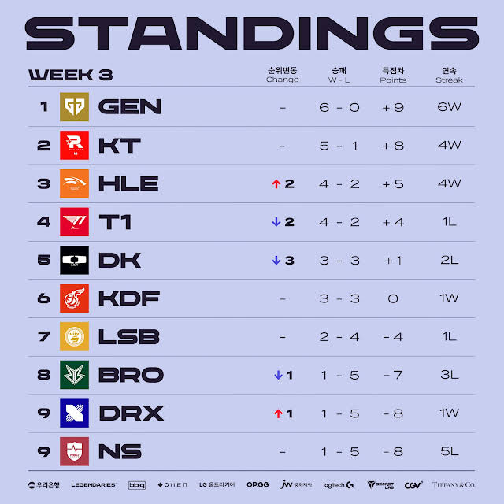
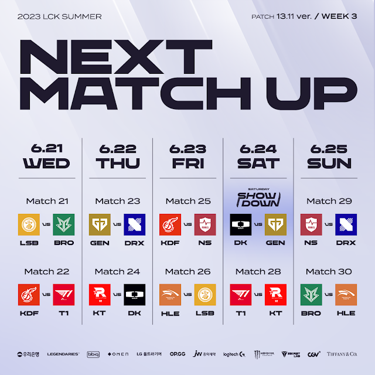
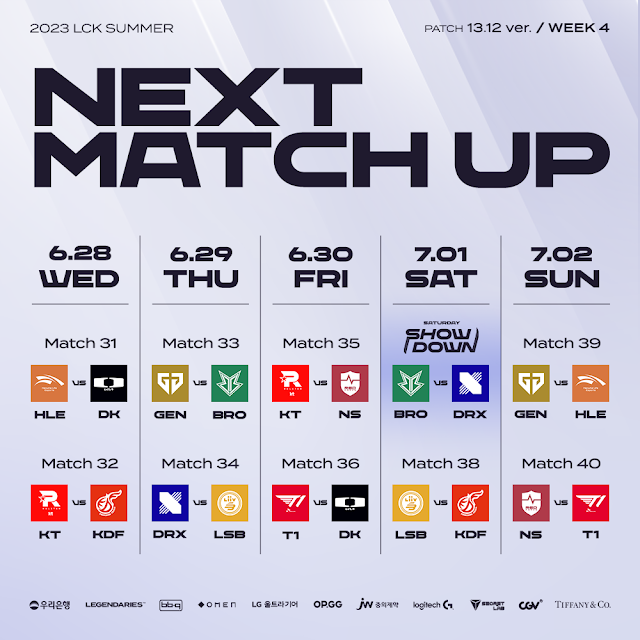

# 순위표

# 주간 매치업

# 팀 별 분석

## GEN

### 2승 (DRX, DK)

DK도 우여곡절이 있었지만 잡아냈고, DRX전은 가볍게 이겼다.

1라운드 전승으로 향해 가는 중

## KT

### 2승 (DK, T1)

아주 중요한 한주를 완승으로 이겨냈다.

특히 T1전 중간 중간 위기가 있었음에도 깔끔하게 이겨낸 것은 정규 시즌 우승 경쟁이 가능한 팀이며, 젠지 전은 사고였다라고 주장해도 될만한 경기력과 결과를 보여주고 있다.

특히 한두라인씩 흔들리거나 아쉬운 경기력의 다른 팀들과 달리 모든 라인이 잘해주고 있다는 것도, 딜 탱 비중도 유연하고 균형적으로 잘 가져가는 밴픽과 팀웍은 앞으로의 시즌도 기대된다.

## HLE

### 2승 (LSB, BRO)

2승이긴하지만, 상대한 팀들이 중하위권 팀들이라 임팩트는 좀 덜하다.

다음 주가 중요할 것

## T1

### 1승 (KDF) 1패(KT)

KT에게 완패를 당했다. 라인전 과정에서는 이득도 꽤 있었음에도 전반적으로 KT가 더 잘해서 스무스하게 패배했다.

포스트 시즌의 T1이라지만, 결승전 패배나 포스트 시즌 패배도 종종 겪는 팀이 된 걸 감안했을 때 정규 시즌의 최종 보스 포스가 사라져 가고 있는 것은 긍정적으로 해석하긴 쉽지 않지 않을까?

## DK

### 2패 (KT, GEN)

여전한 강팀 판독기 신세인가?

KT에게 완패, GEN은 한세트 따냈다지만 결과적으론 패했다.

쇼메이커 캐니언이 조금 더 살아나야 할 것 같다.

## KDF

### 1승 (NS) 1패 (T1)

T1에겐 졌지만, NS를 이겨내며 플옵권을 잘 지켜나가는 중

## LSB

### 1승 (BRO) 1패 (HLE)

BRO는 다행히 이겼다. 못이겼으면 플옵권 도전도 쉽지 않았을텐데, 불씨를 살린 느낌?

## BRO

### 2패 (LSB, HLE)

DK도 이겨놓고 LSB와 HLE에겐 졌다.

분명히 저력도 있고 꽤 괜찮은 모습을 보일 때도 있지만... 쉽지 않을 듯

## DRX

### 1승 (NS) 1패 (GEN)

드디어 첫 승이다.

GEN에게 진 것이야 자연 재해라고 친다면, 그래도 NS와의 경기에서 저력을 보여주며 이긴 것은 아주 아주 다행이라고 볼 수 있을 것이다.

썸머 플옵을 넘어 롤드컵을 가기엔 쉽지 않은 현황이지만, 그럼에도 조금 더 좋은 경기력을 보여줘서 희망을 보여주면 좋겠다.

## NS

### 2패 (KDF, DRX)

DRX에게 결국 지면서 연패가 이어져버렸고, 세트 동률이라지만 DRX와 같은 꼴찌를 기록하게 되버렸다.

쿼드가 생각보다 적응이 힘들어 하다보니 선수 교체가 자주 이뤄지고 있는 것도 좋지는 않은 거 같다.

# 총평

예상과 비슷하지만, KT의 2승! 심지어 완승이자 무실세트 승리가 인상적이다.

* 황 - GEN -> GEN
* 강 - DK, KT, T1 -> KT, HLE, T1
* 중 - HLE, KDF -> DK, KDF
* 약 - BRO, LSB, NS, DRX -> BRO, LSB, NS, DRX

## 4주차

* 4주차 예상
    

### HLE VS DK, HLE VS GEN

한화는 이번주를 망치면 상위권 도약은 어렵다.

과연 체급 생명이 이번 한주를 이겨내고 혼란의 LCK를 만들 것인가?

### T1 VS DK

DK는 위기에 빠져있고, T1도 위기에 빠진 상황에서 어떤 팀이 반등에 성공할까?

두팀 다 탑이 전성기에 비해 아쉬운 경기력과 영향력을 보여주고 있는 문제를 어떻게 극복하려 할지 혹은 다른 라인에서 번뜩임이 보일지 궁금하다.