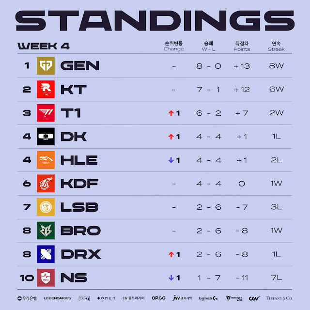
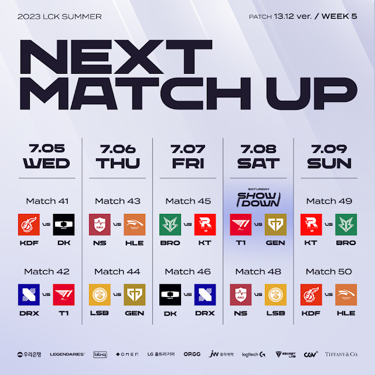

# 순위표

# 주간 매치업

# 팀 별 분석

## GEN

### 2승 (BRO, HLE)

무난히 다 이겼다.

T1과 KT가 아니라면 이 팀을 잡는게 쉽지는 않을 듯?

## KT

### 2승 (KDF, NS)

마찬가지로 하위권팀에는 지지 않는다.

GEN, T1과의 리매치가 기대 된다.

## T1

### 2승 (DK, NS)

DK를 잡아내면서 무난하게 흘러가는 듯 보였으나, NS에게 한세트 내주면서 불안한 경기력도 종종 보인다.

약간씩 흔들리는 폼이 우려이며, 페이커의 팔 부상 이슈도 꽤 중요해보인다.

## HLE

### 2패 (DK, GEN)

클리드의 불미스러운 이슈로, 그리즐리가 출전하면서 중요한 2연전을 모두 내줬다.

플옵권 경쟁 정도가 현실적일 듯?

## DK

### 1승 (HLE) 1패 (T1)

그리즐리가 출전하게 된 HLE를 이기면서 운이 따랐지만, T1에게 패하며 플옵권의 현실을 받아들여야 하는 상황인 느낌이다.

## KDF

### 1승 (LSB) 1패 (KT)

하위권은 다 이기고, 상위권에는 다 지고 있다.

그럼에도 플옵권의 다른 팀들도 4승 4패다보니 꽤 할만한 면도 많이보인다.

한두번만 괴력을 발휘한다면 플옵 경기도 기대해볼만 할지도?

## LSB

### 2패 (DRX, KDF)

중요한 서부권 팀들과의 경기를 모두 내줬다.

특히 DRX에게 진 경기가 빼아픈 패배로, 플옵 경쟁이 쉽지 않을 듯 하다.

## BRO

### 1승 (DRX) 1패 (GEN)

GEN에겐 예상대로 패배하면서 우려를 이어갔지만, DRX를 이겨낸 것이 플옵 희망을 그래도 살린 것이 다행

## DRX

### 1승 (LSB) 1패 (BRO)

LSB를 이기면서 반등인가 싶었지만, BRO에게는 지면서 하위권을 유지중이다.

상위권 팀을 이기긴 쉽지 않은 만큼 플옵이 희망적이라 보긴 어렵지만, 그럼에도 LSB를 이겨서 2승까진 온 만큼 하위권 팀들을 잘 잡아내서 플옵을 노려보는게 현실적일 듯 하다.

## NS

### 2패 (KT, T1)

2패긴하지만 T1전에서 한 세트 따내면서 희망적인 모습도 있긴하다.

그럼에도 결국은 매치는 졌는데, 그럼에도 이러한 한세트 혹은 매치를 따내는 모습을 자주 보여주면 좋겠다.

# 총평

중위권, 상위권이 좀 더 뚜렷해진 모양새다. 다음주에는 대부분 무난한 매치인 만큼, 상위권에서의 승패가 T1이 리 순위를 경쟁으로 몰고갈지, 아니면 1황 체제를 공고히 할지 궁금해진다.

* 황 - GEN -> GEN
* 강 - KT, HLE, T1 -> KT, T1
* 중 - DK, KDF -> DK, KDF, HLE
* 약 - BRO, LSB, NS, DRX -> BRO, LSB, NS, DRX

## 5주차

* 5주차 예상
    

### T1 VS GEN

과연 GEN은 이번 시즌 1위 자리를 확고히 할 수 있을까?

### KT VS BRO 2연전

BRO는 물론 상대적 약팀이지만, 그럼에도 도깨비팀 스러운 면모도 있다보니 KT를 얼마나 흔들 수 있을 지 궁금해진다.