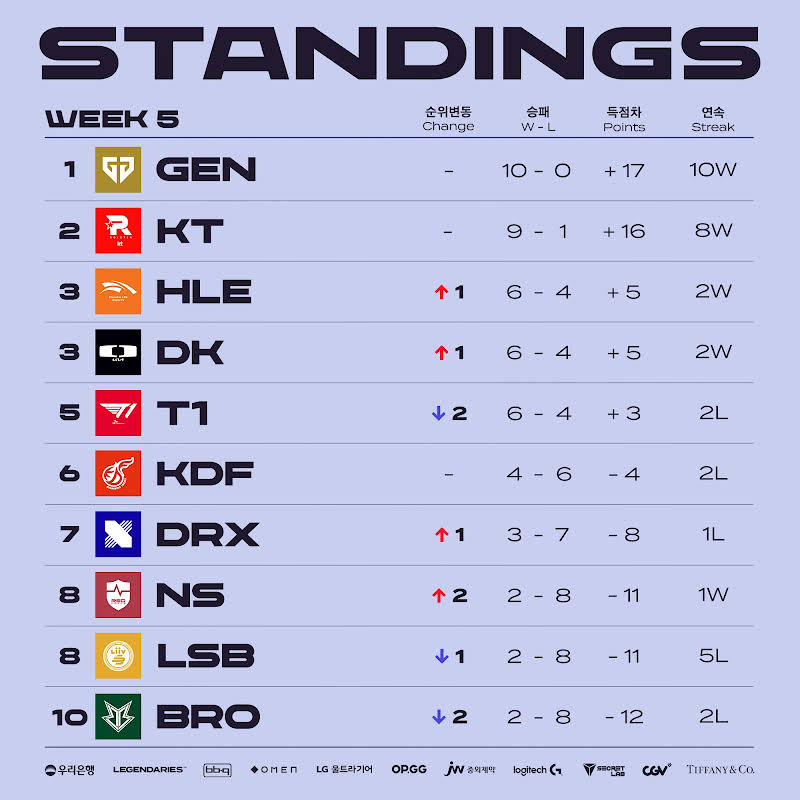

# 순위표

# 주간 매치업

# 팀 별 분석

## GEN

### 2승 (LSB, T1)

지는 법을 모른다.

KT만 꺾는다면 전승 우승도 보이기 시작했다.

## KT

### 2승 (BRO)

너무 잘하고 있다.

GEN전을 넘으면 득실차를 포함하면 1위 달성이 가능한 무서운 기세

BRO 2연전은 기세 유지 차원에서도 너무 좋았던 연전으로 작용한 거 같다.

## HLE

### 2승 (NS, KDF)

그리즐리도 적응했나? 아니면 강팀 판독기?

물론 플옵권 경쟁팀이던 KDF를 잡아낸 것은 아주 중요했지만, 서부권 팀들 상대로 승리라 더 두고 봐야 겠다.

## DK

### 2승 (KDF, DRX)

강팀 판독기인가? 수문장인가?

물론 좋은 경기력이었다지만, 강팀과의 매치가 중요하겠다.

## T1

### 2패 (DRX, GEN)

페이커가 빠지고 포비가 들어왔으니, GEN전은 어렵다고 생각했지만 DRX전도 졌다. 그것도 압도적인 차이로

페이커가 얼마나 팀에 중요한 존재였는가가 보이는 동시에, 벵기 감독의 사임이 겹쳐 1~2위로 2라운드 직행은 쉽지 않을 전망이다.

## KDF

### 2패 (DK, HLE)

동부팀 상대로 다 졌다.

4승 4패 동률에서, 혼자만 4승 6패를 기록하며 추격의 여지를 크게 남겨 플옵 전망에 물음표를 남기고, 좋은 기세였던 광동의 기세 자체가 꺾인 거같은 우려도 된다.

## DRX

### 1승 (T1) 1패 (DK)

이걸 DRX가?

T1을 깔끔하고 압도적 경기력으로 잡아냈다.

물론 페이커의 부상으로 포비라는 신인 미드 라이너가 출전했다지만 이렇게 잘할 줄이야...

반전의 시작인가?

## NS

### 1승 (LSB) 1패 (HLE)

LSB를 잡아내면서, 2승 8패라인에 합류!

지난주 T1전도 한 세트 잡아낸 저력이 있었으니, 의외의 플옵 경쟁 구도를 만들어 낼 수도?

## LSB

### 2패 (GEN, NS)

GEN전은 그렇다쳐도 NS전을 패배하면서 더욱 어두운 미래가 우려된다.

## BRO

### 2패 (KT)

플옵 희망을 살려야 하는 시기에 2연패를 하면서 우려가 커지고 있다.

2승라인이긴 하니까, KDF가 부진하다면 그래도 기회가 이어질 수도?

# 총평

1패가 있다지만, 2대0 승리를 반복하고 있는 KT는 황이라 불릴만하다.

사실상 다다음주 KT VS GEN 매치가 1위 쟁탈전이나 다름 없을 걸로 보여진다.

* 황 - GEN -> GEN, KT
* 강 - KT, T1 -> HLE, DK, T1
* 중 - DK, KDF, HLE -> KDF
* 약 - BRO, LSB, NS, DRX -> BRO, LSB, NS, DRX

## 6주차

* 6주차 예상
    

### DK VS T1

DK는 과연 흔들리는 T1을 잡고 상위권 싸움에 뛰어들 수 있을까?