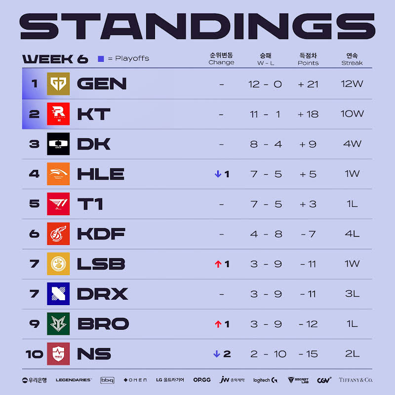
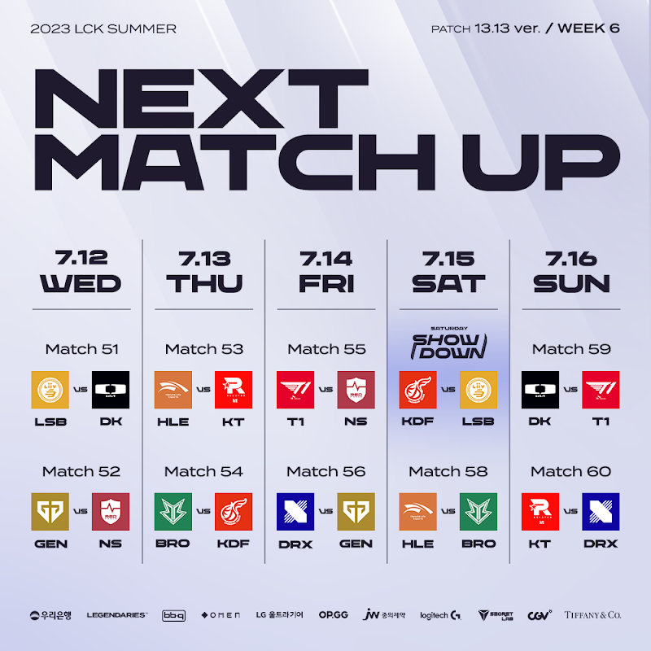
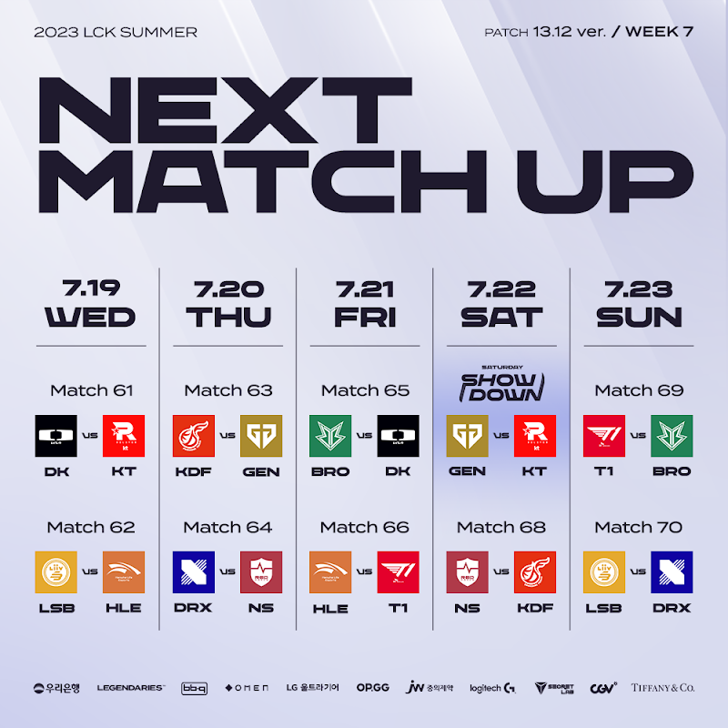

# 순위표

# 주간 매치업

# 팀 별 분석

## GEN

### 2승 (NS, DRX)

무난했다. 클템의 찍어x3에서도 별 얘기 없을 정도

## KT

### 2승 (HLE, DRX)

HLE전보다 DRX전이 위험했음

기적의 역전승으로 매치 승을 따온게 다행인 수준이었고, DRX는 중후반 집중력이 크게 아쉬웠다.

## DK

### 2승 (LSB, T1)

살아났다!

물론 페이커가 빠진 T1이긴 하지만, 캐니언이 살아나고 있다는 것은 칸나 쇼메이커 폼만 좀 더 돌아오면 포스트 시즌과 롤드컵을 기대해도 될 징조일 수도?

## HLE

### 1승 (BRO) 1패 (KT)

여전한 판독기

여러모로 쉽지 않다

## T1

### 1승 (NS) 1패 (DK)

페이커가 있던 1라운드보다 더 깔끔하게 NS를 잡아내면서 기대하게 했지만, DK에겐 무기력하게 패배했다.

디펜스 모드에서 오랜 시간 잘 버틴 부분도 있긴 했지만...

페이커만 오매불망 기다리는 중일 듯

## KDF

### 2패 (BRO, LSB)

4승 4패에서 패배만 늘어가는 중

특히 BRO, LSB에 지면서 멘탈적으로도 성적 측면에서도 우려가 커지는 중

## LSB

### 1승 (KDF) 1패 (DK)

KDF를 잡아내며 플옵 희망을 살려냈다.

동부리그 팀들간의 경기가 중요 할 듯

## DRX

### 2패 (GEN, KT)

KT를 잡아낼 뻔 했던 경기를 역전패 당한 것이 뼈아플 듯

그럼에도 그런 상황을 만들어 낸 저력과 기세는 충분히 플옵 희망을 이어갈 수 있을지도?

## BRO

### 1승 (KDF) 1패 (HLE)

KDF전을 이겨내며 희망을 계속 이어가고 있다.

DK도 잡아냈던 저력이 있는 만큼 몇경기만 잡아내면 플옵 막차 가능성이 보이기도 하는 듯 하다.

## NS

### 2패 (T1, GEN)

서부 리그 팀들에게 진 경기니 그래도 희망이 아직 있다. 플옵권이 고작 4승이다.

# 총평

KT가 흔들렸지만 이겨내면서 황의 자리를 유지하는 듯 하다.

다음주 KT VS GEN 매치가 1위 쟁탈전이나 다름 없을 걸로 보여진다.

KDF는 많이 주춤하면서 사실상 5약으로 불려야 하는거 아닌가 모양새지만, 그래서 플옵 막차 경쟁이 더 치열해진 느낌도 있다.

* 황 - GEN -> GEN, KT
* 강 - KT, T1 -> HLE, DK, T1
* 중 - DK, KDF, HLE -> KDF
* 약 - BRO, LSB, NS, DRX -> BRO, LSB, NS, DRX

## 7주차

* 7주차 예상
    

### DK VS KT

과연 KT는 2황은 어나더 레벨임을 증명할 까?

### KT VS GEN

GEN가 이기면서 정규 시즌 전승 우승각? 아니면 2황 싸움으로 몰고 갈까?

두팀 다 너무 폼이 좋아서 큰 기대가 되는 매치다.