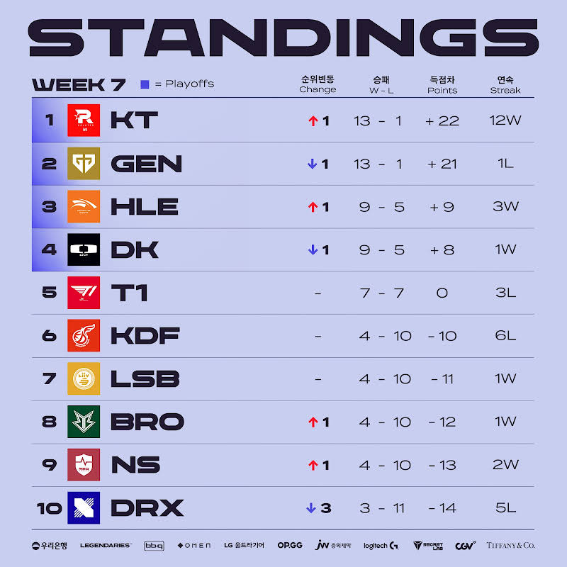
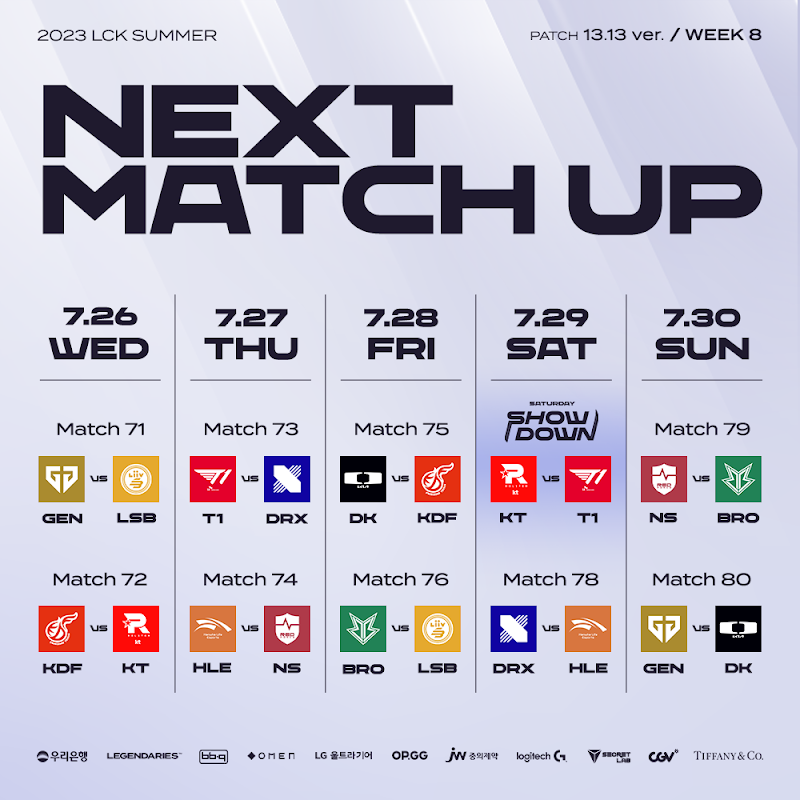

# 순위표

# 주간 매치업

# 팀 별 분석

## KT

### 2승 (DK, GEN)

DK는 KT의 상대가 되지 못했다.

GEN전마저 압도적으로 이겨내면서, 단독 1위를 달성했다.

1위와 2위의 어드밴티지 차이는 꽤 있는 편이기도해서, 세트 득실 차이 관리까지 필요했는데 이 부분도 2:0으로 이기면서 큰 보탬이 된 많은 것을 얻어간 매치.

## GEN

### 1승 (KDF) 1패 (KT)

KDF와의 경기에서도 이겼지만 경기력이 애매하더니, KT전은 완패했다.

플옵 경기력을 끌어 올려야 하는 시기에 조금 위험하다고 볼 수 있지만, 스프링에서도 미리 맞은 매가 큰 득이 되어 돌아온 만큼 지켜볼 필요도 있을 거 같고, 첫패일 뿐이다.

## HLE

### 2승 (LSB, T1)

흔들리는 T1과, LSB를 잡아내며 3~4위권에 안착했다.

1~2위는 물건너갔다고 봐야하지만, 플옵에서 경기력이 잘 나온다면 그리즐리를 안고도 롤드컵 가능 할 지도?

## DK

### 1승 (BRO) 1패 (KT)

KT가 너무 잘하는 중이라 비교가 어렵지만, KT에 지면서 3~4위권으로 만족해야 할 분위기로 가고 있다.

중요한 것은 GEN, KT는 여전히 못이겨내는 3~4위권 팀의 모습이기에 이 부분을 플옵에서 잘 극복할 수 있을지 여부라고 할 수 있겠다.

## T1

### 2패 (HLE, BRO)

HLE는 그렇다 쳐도, BRO에게도 졌다.

플옵이야 가겠지만... 페이커가 복귀 한다고 해도 플옵에서 괜찮을까?

## KDF

### 2패 (GEN, NS)

GEN전에는 꽤 잘했지만 결국 졌다.

상위권 GEN은 그렇다 쳐도, NS에게 까지 지면서 6연패다.

아직 플옵권 4승 라인이지만, 가장 비관적인 전망이 예상되는 슬픈 상황

## LSB

### 1승 (DRX) 1패 (HLE)

HLE에는 졌지만, DRX를 이겨내면서 4승 라인 달성했다.

플옵에 희망을 살리는 중

## BRO

### 1승 (T1) 1패 (DK)

DK에는 졌지만, T1을 아주 오랜만에 잡아내며 4승 라인에 올라섰다.

앞으로의 대진을 감안해도 은근히 플옵 가능성이 젤 높을지도?

## NS

### 2승 (DRX, KDF)

와...! 막판 반전

2승을 거둬내며 4승라인에 합류했다.

플옵가기 위한 앞으로의 대진은 쉽지 않지만, 무너지는 하위권 팀의 모습이 아니라서 박수 쳐주고 싶다.

## DRX

### 2패 (NS, LSB)

동부 리그 매치에서 모두 졌다.

혼자 3승라인이라, 쉽지 않고 대진도 쉽지 않다.

# 총평

KT가 해냈다. DK, GEN전 압도적인 승리를 통해서 사실상 이번 시즌 1황에 근접하지만, 미묘한 차이니 만큼 GEN과 함께 2황 체제를 구축했다.

T1은 흔들리면서, 플옵까진 가겠지만 앞으로가 걱정 되는 모양새고, 마지막 플옵 한자리 경쟁이 아주 치열해진 재미난 형세다.

이전 시즌들과 다르게 하위권 팀들에게도 기회가 있는 구도로 마지막 주 까지 가지 않을까 싶은 재밌는 시즌이 펼쳐진 듯 하다.

* 황 - GEN, KT -> GEN, KT
* 강 - HLE, DK -> HLE, DK
* 중 - KDF -> T1
* 약 - BRO, LSB, NS, DRX -> KDF, BRO, LSB, NS, DRX

## 8주차

* 8주차 예상
    

### T1 VS DRX

흔들리는 T1, 그리고 이미 한번 T1을 잡아냈던 DRX

이 경기를 지면 DRX는 사실상 플옵은 물건너 간다.

DRX에게 원코인이 더 주어질까?

### KT VS T1

흔들리는 T1이라지만, KT에게 T1은 하위권일때도 항상 어려웠던 팀이다.

과연 이번엔 무난하게 이길 수 있을까?

### GEN VS DK

GEN의 우세가 점쳐지지만, 그럼에도 DK와 GEN 모두 플옵에서 붙을 확률이 높은 만큼 전력 탐색전의 성향도 띄고 있지 않을까 싶다.

플옵은 두 팀 다 확정이고, 2라운드 여부도 확정인 팀들인 만큼 플옵을 겨냥한 다양한 시도가 펼쳐질 수도 있겠다.