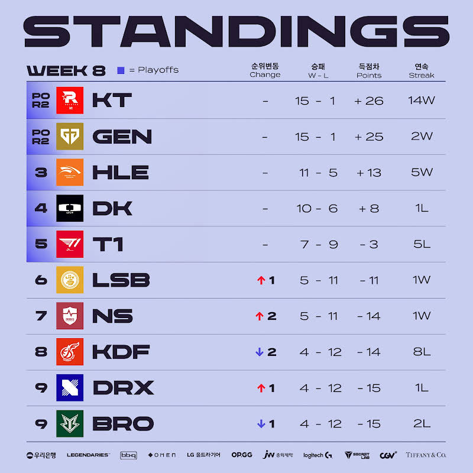

# 순위표

# 주간 매치업

# 팀 별 분석

## KT
### 2승 (KDF, T1)

KDF는 연패중이니 그렇다 쳐도, 페이커 없는 T1은 KT의 상대가 전혀 되지 못했다.
차주 대진도 무난한 만큼 1위 확률은 아주 높아진 상태다.

## GEN
### 2승 (LSB, DK)

KT말곤 상대가 되지 않는다고 말하는 듯 압승을 거뒀다.
흔들렸던 KT와의 경기와는 다르게 경기력도 다시 올라오는 중인 것도 호재

## HLE
### 2승 (NS, DRX)

서부 리그 팀들을 모두 잡아내며, 플옵 3위에 한껏 가까워졌다.
2황을 상대로 잘 해낼 수 있을지가, 플옵 이후의 롤드컵까지의 관건일 듯
## DK
### 1승 (KDF) 1패 (GEN)

HLE와 비슷하게 상위권 팀에게 못이겨내지만, 하위권 팀은 잘 잡아내는 형국
플옵과 선발전의 반전이 중요해 보인다.

## T1
### 2패 (DRX, KT)

DRX에게 이번 섬머 2경기 모두 지면서, 플옵은 가게 됐지만 5위로 진출하게 됐고 이로 인해 쉽지 않은 대진이 예상된다.

플옵도 플옵이고, 선발전을 위해선 페이커가 돌아오고 경기력이 다시 올라오는 것이 중요할 듯 하다.
## LSB
### 1승 (BRO) 1패 (GEN)

GEN전은 완패였지만, BRO 상대로 승리를 해내면서 플옵 확률을 꽤 높였다.
경기력도 괜찮다.

## NS
### 1승 (BRO) 1패 (HLE)

BRO와의 경기를 잡아내면서 5승 라인 합류.
신인 위주로 이런 승수를 쌓은 걸 보면 내년도 기대해봄직해보인다.

아쉽게도 대진이 좋지 않아 플옵은 5승임에도 쉽지 않을 듯

## KDF
### 2패 (KT, DK)

많았던 기회 다 놓치고, 대진을 봐도 경기력을 봐도 플옵은 물건너 갔다고 봐야 할 듯.
안타깝다.

## DRX
### 1승 (T1) 1패 (HLE)

T1에게 섬머 2경기 다 이기면서 희망의 불씨를 살렸다.
전체적 팀의 경기력이 좋아지는 측면도 꽤 보여서 가능성이 괜찮은 거 같기도?

## BRO
### 2패 (NS, LSB)

서부 리그와의 대전을 둘다 지면서, 사실상 물건너 간 플옵.
고생했다 브리온

# 총평

상위권 등수는 3위 제외하면 정해졌다고 봐도 무방 할 것 같고, 막판까지 중요해진 플옵 막차 싸움이 볼만해보인다.

만약 하위권 팀들이 GEN이나 KT를 잡아내면 그것도 나름 볼만 할 듯?

* 황 - GEN, KT -> GEN, KT
* 강 - HLE, DK -> HLE, DK
* 중 - T1 -> T1
* 약 - KDF, BRO, LSB, NS, DRX -> KDF, BRO, LSB, NS, DRX

## 9주차
* 9주차 예상
    

### HLE VS GEN

순위 싸움과 무관하게 플옵에서의 경기력을 서로 미리 엿볼 수 있는 프리 플옵이라고 봐도 재밌겠다.

### DK VS HLE

플옵 1라 대진의 선택권이 있는 3위 결정전인 만큼 이번 주의 가장 중요한 경기다.
개인적으로 어느 팀이 이길지 모를 만큼 비슷한 면모도 많이 보여줘서, 기대되고 재밌을 것 같다.