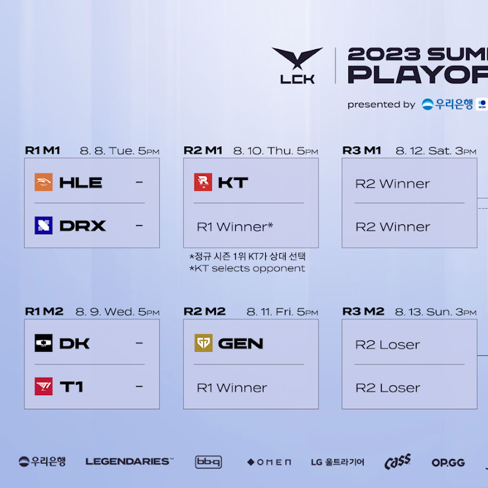

# 대진표

# 예상

## HLE VS DRX

HLE가 무난히 이길 듯 하다.

마법같은 미라클런을 보여준다면 모를까, 전반적으로 봤을 때 체급 자체가 밀리는 느낌이다.

승부수를 띄워보면서, 각을 본 뒤 잘 안통하면 롤드컵 선발전을 대비하는 것이 합리적으로 보이는 DRX다.

## DK VS T1

승수가 꽤 차이가 나지만, 그럼에도 T1의 저력은 무시못한다고 본다.

다만 쉰 게임수가 꽤 되는 데다가, 지금 메타가 T1에게 여전히 좋지 않은 측면이 있어 DK가 우세하지 않을까?

3위 결정전에서 쇼메이커의 폼이 바닥이었던 것이 걱정 포인트긴 하지만, 그런 측면 모두를 감안해도 여전히 DK가 조금이라도 우세하다는 생각이 든다.

# 2라운드 예상 지목

만약 내 예상대로 HLE와 DK가 올라온다면  KT는 아마 HLE를 지목하지 않을까 싶다.

둘다 비슷한 전력 같지만 그럼에도 HLE가 상대하기에 상성상 좋아보인다 보지 않을까? 특히 그리즐리를 파훼할 자신도 있어보이고, 정면 승부에서는 KT가 훨씬 강할 것으로 보이기 떄문이기도 하다.