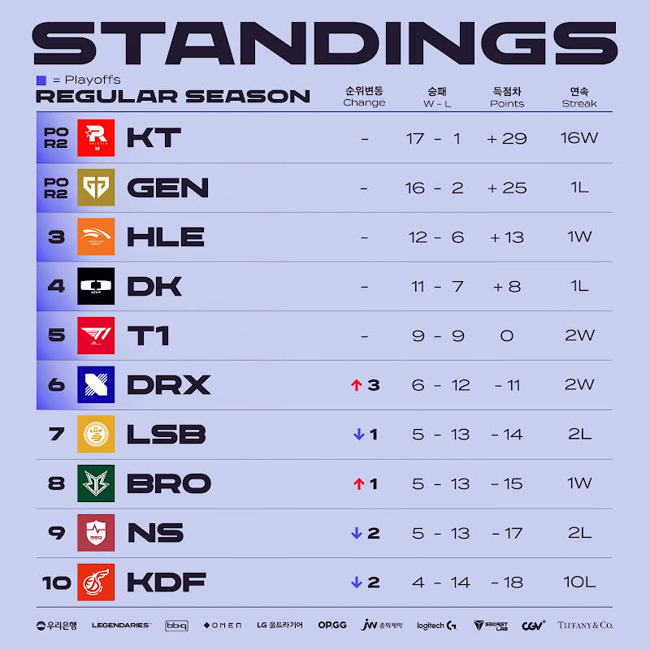
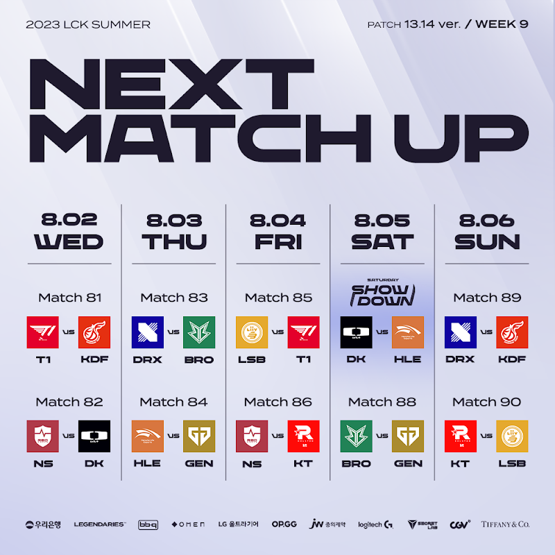

# 순위표

# 주간 매치업

# 팀 별 분석

## KT
### 2승 (NS, LSB)

NS에 질뻔 했던 위기를 팀합으로 극복해냈다.

이번 시즌 KT는 진짠가? GEN과 KT를 동시에 응원하는 나는 어째야 한단 말인가...?

개인적으로 기인의 역사를 돌이켜봤을 때 KT 우승도 좋아보인다.

또한 롤드컵에서 일낼 포텐을 가진 팀도 KT가 가장 확률이 높아보이는 지금이다.

## GEN
### 1승 (HLE) 1패 (BRO)

KT말곤 다 쉽다라는 듯 HLE도 압승을 거뒀다.

BRO전의 패배가 플옵을 앞둔 시도인지, 경기력인지는 확실치 않지만 중요한 것은 플옵 2라운드이니 만큼 잘 준비해서 이겨내리라 본다.

특히 KT말곤 적수가 없음을 보여줬던 경기가 워낙 많아서, 결국엔 KT전을 포커싱하고 여러가지 준비가 필요해보인다.

## HLE
### 1승 (DK) 1패 (GEN)

서부 리그 팀들을 모두 잡아내며, 플옵 3위에 한껏 가까워졌다.
2황을 상대로 잘 해낼 수 있을지가, 플옵 이후의 롤드컵까지의 관건일 듯

## DK
### 1승 (NS) 1패 (HLE)

한화 생명과의 3위 결정전에서 완패를 거두면서, 플옵 전망이 조금 우울해졌다.

특히 T1과 맞붙게 된 지금, 4위와 5위 싸움이고 승수가 크게 차이 난다지만 쉽지 않을지도 모르겠다.

## T1
### 2승 (KDF, LSB)

돌아온 페이커는 강했다

특히 팀의 움직임 전체가 좋아진 것은 메인 오더가 페이커였기 떄문일 것 같다.

플옵도 기대해볼만 할 지도?

## DRX
### 2승 (BRO, KDF)

마지막 주에 동부 대결을 모두 이겨내며 막차 탑승에 성공했다.

플옵과 동시에 롤드컵 선발전이 남은 만큼 결과도 결과지만 경기력과 포텐을 보여주는 것이 중요할 듯 하다.

## LSB
### 2패 (T1, KT)

T1에게도 결국 졌고, KT에게는 2군이 나온 2세트 마저 내주면서 탈락했다.

뭔가 풀릴듯 말듯 아쉬웠던 경기력이 안타까웠다.

## NS
### 2패 (DK, KT)

대진이 좋지 않아 결국 탈락했지만, KT를 잡을 뻔한 저력을 보여줬기에 오히려 다음 시즌이 기대되는 팀은 KDF가 아닌 NS아닌가 싶은 마무리를 보여줬다.

## KDF
### 2패 (T1, DRX)

마지막 경기까지 기회가 있었음에도 결국 졌다.

2라운드 전패라는 안타까운 결과로... 다음 시즌에 대한 기대가 쉽지 않아보인다.

특히 몇몇 선수의 폼은 정말 심각해서, 2년을 바라본다는 씨맥이었지만 내년 로스터는 바뀌어야 한다는 여론이 조성 된 것도 안타까운 점

## BRO
### 1승 (GEN) 1패 (DRX)

DRX에게 지면서 빠르게 플옵 탈락했지만, GEN을 잡으면서 저력을 보여줬다.

마지막 주까지 낮은 확률이었지만 가능성이 있었기에, 그리고 엄티는 여러모로 잘하는데 너무 아쉬운 결과다.

# 총평

아슬아슬한 막차를 DRX가 탔다.
이 막차가 중요한 것은 롤드컵 선발전 티켓 획득이기도 하기 때문

DRX 축하한다

* 황 - GEN, KT -> GEN, KT
* 강 - HLE, DK -> HLE, DK
* 중 - T1 -> T1, DRX
* 약 - KDF, BRO, LSB, NS, DRX -> KDF, BRO, LSB, NS
