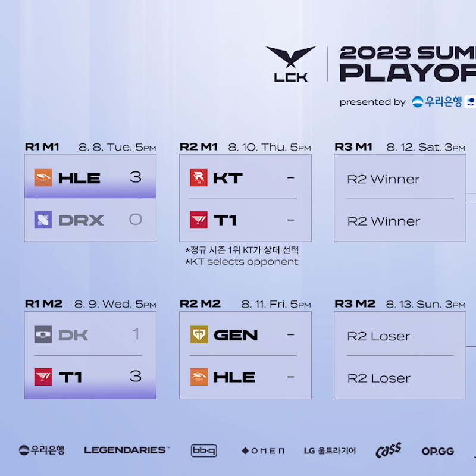

# 대진표

# 예상

## KT VS T1

의외다. KT는 HLE를 고르지 않고 T1을 골랐다.

패자전이 있다곤 해도, T1과 GEN을 붙이는 것이 유리해보였으나, 큰 그림을 봤을 때도, 직접적인 전력이나 상성 등에서 우위가 있다고 본 것일까?

DK를 잡았다곤 해도 T1이 엄청나게 잘했다기보단 DK가 못한 느낌도 없지 않아서 KT의 승리가 예상 된다.

## GEN VS HLE

체급 생명에 메타와 챔피언 패치가 웃어주는 HLE라고 해도, GEN가 유리해보인다.

GEN의 매서운 기세가 HLE을 압도할 수 있을지 궁금해진다.

GEN 입장에선 T1의 저력이 더 무서웠을 텐데, 조금 더 유리한 대진이 성사된걸로 봐도 좋지 않을까 싶을 만큼, HLE와의 상성은 여러가지 측면에서 봐도, 전력상으로 봐도 더 승리 확률이 높지 않을까 싶다.