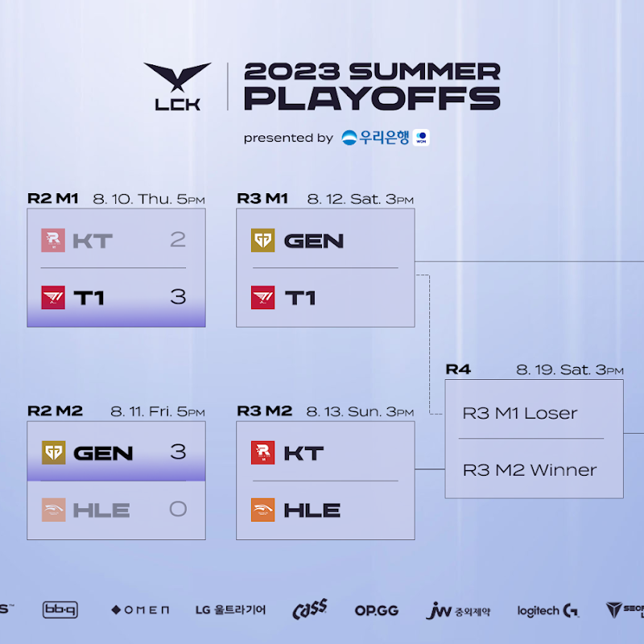

# 2라운드 결과

## KT VS T1

다전제에 약한 KT?

스태틱 이슈로 인한 패배를 제외하면 완벽했던 KT의 정규 시즌이 무너졌다.

다전제의 밴픽과 인게임 플레이의 중심이 잡혀있지 못한 모습을 보이며 패자조로 내려갔다.

반면 T1은 꽤 훌륭한 판단과 팀 합을 보여주며 승자조로 합류

앞으로에 대한 기대를 품게했다.

## GEN VS HLE

경기 중간 중간 아쉬운 흔들릴 때도 있었지만, 결국에는 체급 생명을 상대로 체급의 젠지라고 말하는 듯 압도적인 승리를 거뒀다.

특히 2세트 질뻔한 경기를 뒤집어 내는 저력은 GEN가 체급과 노련함을 모두 갖춘 우승 후보이며, 롤드컵을 눈앞에 두고 흔들리지 않고 있음을 말해주는 듯 했다.

# 3라운드 대진표

# 예상

## 승자조 GEN VS T1

지난 스프링과 동일한 대진이지만, 입장과 예상은 조금 다르다.

KT에 비해 T1이 잘했다지만 여전히 의구심이 드는 포인트가 있는 T1과, 압도적인 승리를 거두며 증명하고 있는 GEN는 분명히 GEN이 유리해보인다.

특히 바텀까지 갈 필요 없이 상체가 해주면서 거둔 3:0 승리는 기세 측면에서도 충분히 GEN의 우세를 점칠만 한 듯 싶다.

## 패자조 KT VS HLE

상성적으로 KT가 HLE에 완승을 거둘 것 같지는 않지만, 그럼에도 KT가 3:1이나 3:2 정도의 승리를 하지 않을까 싶다.

KT보다 밴픽이나 인게임 플레이가 아쉬웠어도, KT는 분명히 장점을 더 많이 증명하고 보유한 팀이기에 HLE보다 유리하지 않을까 싶다.