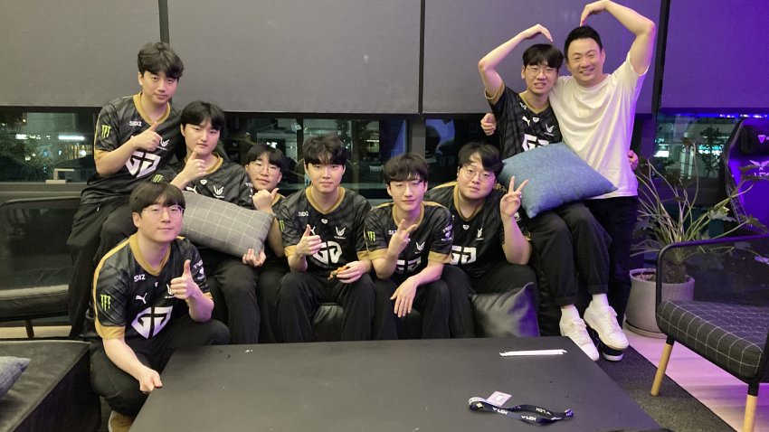
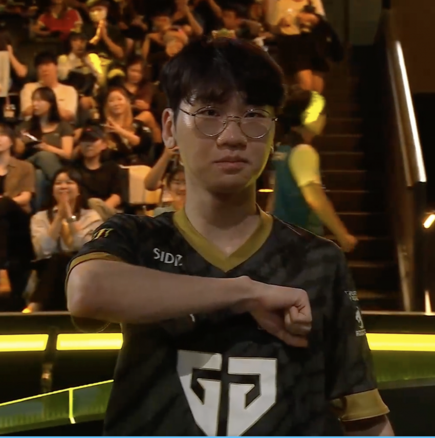
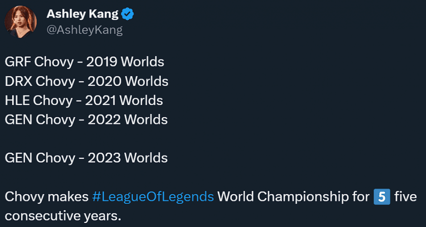
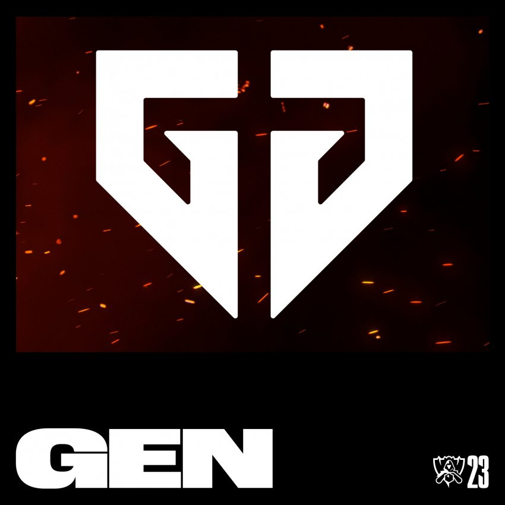
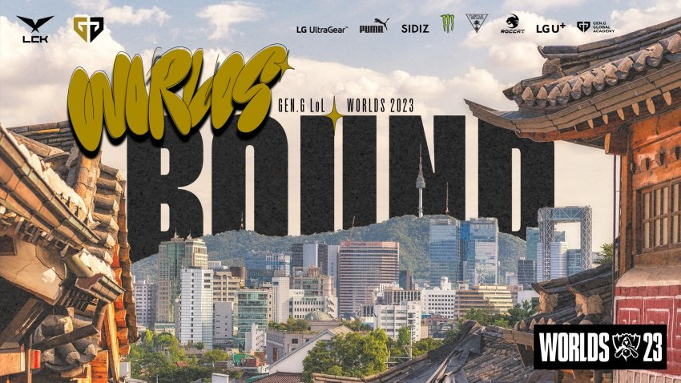

# 3라운드 결과

## 대진표  

## 승자조 GEN VS T1

매서웠다. 사실 3세트가 끝나고, 4세트 밴픽을 봤을 때 가능성이 아주 아주 높다고 봤다.

GEN는 승부수를 던졌고, 그 무거운 무게감을 쵸비가 이겨내면서 승부를 5세트로 돌렸고, 5세트에서도 승리하면서 4연속 결승 진출, 3연속 우승에 도전, 그리고 롤드컵 진출까지 많은 것을 얻어냈다.

4세트에서 요네는 절대 하지마 밴픽에서 결국 요네를 꺼냈고 캐리 해낸 GEN의 저력도 돋보였지만, 갱플랭크를 망가뜨리고 아쉬운 블루 교전에서의 대패가 T1입장에선 뼈아팠다.

한 끗 차이였던 만큼 최종전에서도 경쟁력을 보여줄 거라는 기대가 되는 부분이기도 하다.

### GEN 결승전 진출, 롤드컵 진출!

놀랍게도 쵸비는 5연속 롤드컵 진출을 이뤄냈으며, HLE에서의 전설적인 미드 캐리 롤드컵 8강은 그의 클래스를 증명해준다.

## 패자조 KT VS HLE

KT가 HLE에 정글 저격밴과 함께 압승했다.

이견의 어지가 없는 완승이자 완패.

그래도 HLE는 3시드 결정전부터 시작하므로 2번의 기회중 하나만 잡아도 롤드컵인 만큼 경기력과 단점 극복에 포커스를 맞추면 되지 않을까 싶다.

# 4라운드 및 최종 진출전

## 대진표

## 4라운드 최종 결승 진출전 

KT는 반전에 성공한 만큼 T1과의 승부에서도 다를 수 있을거라는 기대를 하기에 충분하지만, 그럼에도 다전제의 T1이고 KT를 상대로 매번 강한 모습을 보여주는 T1이라 쉽지 않을 걸로 보여진다.

그럼에도 개인적인 예상은 KT가 올라오지 않을까 싶다.
KT가 지난 경기 만큼의 탑에서 무너짐이 보이지 않는다면, 총체적으로 KT의 밸런스가 더 좋다고 생각하기 떄문이다.

## 결승전

GEN VS KT라고 했을 때, KT의 우세가 예상된다.

1시드를 그리고 5년만에 섬머 우승을 차지하면서 KT가 오랜만에 챔피언이 되지 않을까 예상해본다.

특히 바텀의 폼이 극복 되지않는다면 더더욱 무게추가 KT로 기울지 않나 싶다.

반면 바텀의 폼이 돌아온다면 반반에 가까운 황금 밸런스가 기대된다.