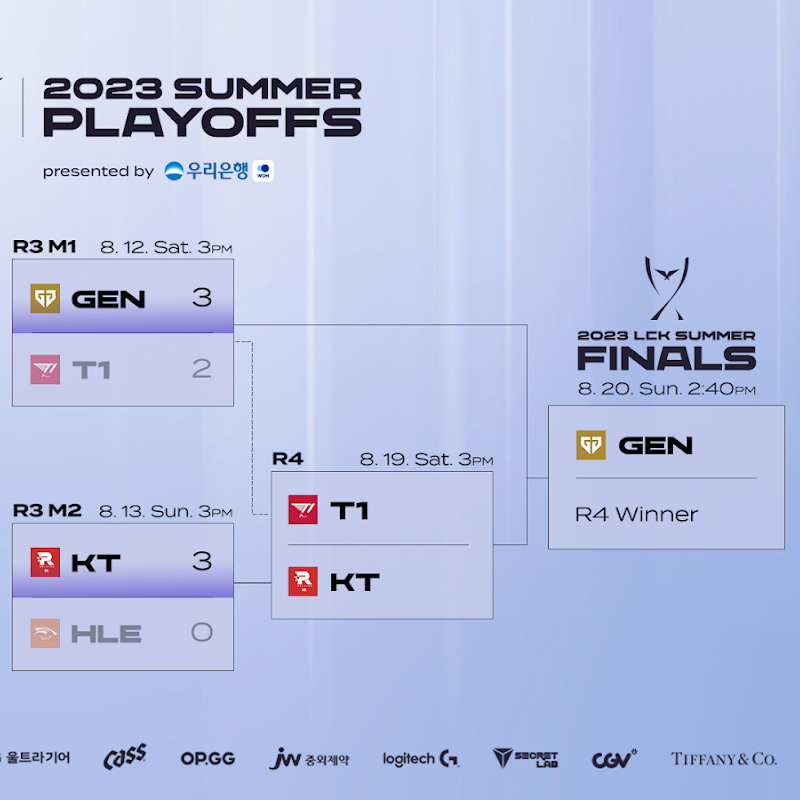
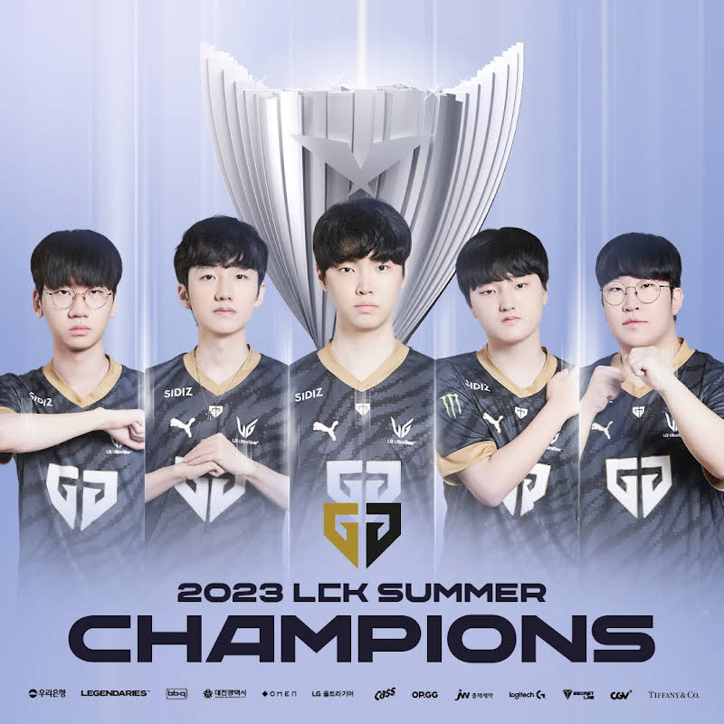
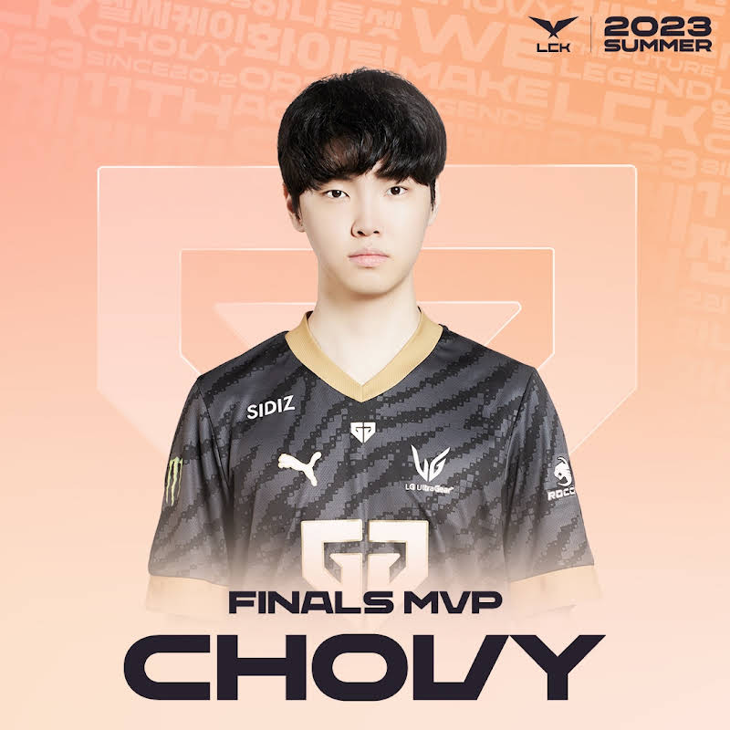
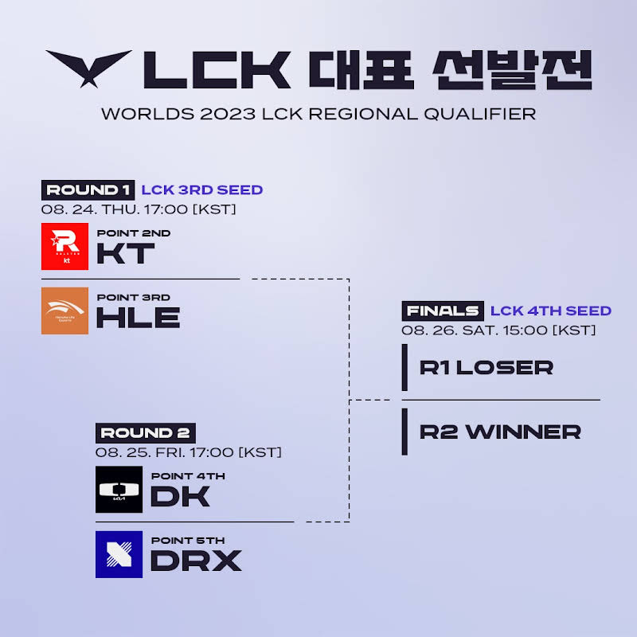

# 결승 진출전, 결승전

## 대진표  

## 결과

## 결승 진출전 KT VS T1

요약하면 KT가 오만했다.

HLE와의 경기에서는 그리즐리를 파는 밴픽을 했으나, T1전에선 한주만에 자만심이 생긴 것인지 T1이 원하는 밴픽을 마음껏 풀어주고 상대하려 했다.

우승의 절호의 기회에서 다전제에서 두번 연속 T1에게 고배를 마시며, 선발전 행을 스스로 결정 지은 모양새였다.

T1전 5세트에서 운이 엄청나게 따랐음에도 아이러니한 밴픽은 롤드컵 여정도 쉽지 않을 수 있다는 생각도 들었다.

## 결승전 GEN VS T1

바로 전날 경기를 보고 확신한 것인지, 확신의 고정 3밴 (아지르, 자야, 니코)를 하면서, 압승했다.

심지어 3번째 경기는 실험판을 열었음에도 이 경기를 쵸비의 클러치 플레이를 통해서 이겨내면서 폼과 역량에서 앞서 있는 매치업이었음을 보여주었다.

특히 쵸비가 미쳐 날 뛰었는데, 다른 멤버 어느 누구도 부족한 모습을 보이지 않고 압승을 거둬내며 롤드컵과 아시안 게임을 기대할만 한 폼을 보여줬다.

도란의 경우 탑솔러 최초 쓰리핏을 해내면서, 자신에 대한 물음표를 지워냈으며, 신인과 하위권 팀 출신 서포터와 함께 이뤄낸 LCK 3연패는 롤드컵에서만 좋은 성과를 거둔다면 말 그대로 쵸비의 시대를 증명하는 기회가 될 수 있겠다.

쵸비는 파이널 MVP까지 차지하면서, 한체미라는 것을 드디어 결국 증명했다.

세체미도 꼭! 꼭! 이뤄냈으면 좋겠다.

그러기 위해서는 이 좋았던 폼과 합이 중요 경기 시점에서 꼭 올라왔으면 싶다.

작년에도 DRX가 기적적이긴 했지만, 사실 아이러니했던 젠지의 폼이 문제였다고 보기 때문이다.

# 선발전

## 1라운드 3시드 결정전 KT VS HLE

3:0을 두번 당한 HLE, 그것도 KT에게도 당했던 만큼 쉽지 않을 것 같다.

특히 마오카이, 세주아니를 밴 당하면 무력해지는 그리즐리, 그리고 체급으로만 이겨온 HLE에 비해 훨씬 더 유연하고, 강점이 많은 KT라고 생각한다.

KT가 지난 플옵에서 했던 것 처럼 그리즐리 정글 밴을 유지하고, 압승해서 안전하게 3시드로 진출했으면 한다.

## 2라운드 DK VS DRX

아무래도 전력차가 크다보니까, DK가 무난하게 이길 것이라고 본다.

DRX는 기적을 바래야겠지만, 쉽지 않을 듯

## 3라운드 4시드 결정전 3시드 패자 VS DK

아마도 HLE VS DK라고 가정한다면, DK의 손을 들어주고 싶다.

아무래도 운영이나, 초반 메이킹의 장점, 그리고 캐니언과 그리즐리의 대진에서 캐니언이 더 보여줄 것이 많을 거라는 기대가 되기 때문이다.

개인적으로 팀의 밸런스가 DK가 더 좋기에 롤드컵에서의 성과가 기대된다.